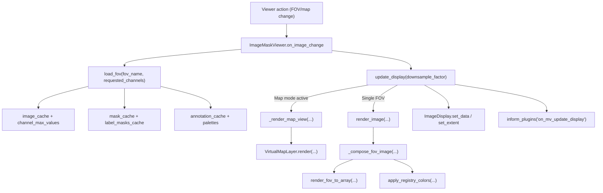

# FOV (image) load cycle — developer overview

This document captures how `ImageMaskViewer` (defined in `ueler/viewer/main_viewer.py`) loads, caches, and renders Field of View (FOV) data during an interactive notebook session. The emphasis is on the steady-state runtime path triggered when end users swap FOVs, pan/zoom, or toggle overlays.

## Event flow in context
- A viewer action (FOV dropdown, ROI navigation, map jump, etc.) drives `ImageMaskViewer.on_image_change`.
- `on_image_change` materialises FOV assets through `load_fov`, reconciles widget state, and normalises the Matplotlib toolbar history.
- `update_display` recomputes the viewport, chooses between stitched-map and single-FOV rendering, feeds data to `ImageDisplay`, and notifies plugins.

## `ImageMaskViewer.on_image_change(change)`
- Reads the active FOV from `self.ui_component.image_selector.value` (or receives `None` during initial wiring) and invokes `load_fov` so the channel dictionary is populated.
- Updates geometry (`self.width`, `self.height`) using the first loaded channel, mirrors those dimensions into `ImageDisplay`, and resets axis limits to `[0, width] × [height, 0]` to honour the inverted Y axis.
- Rebuilds channel controls: preserves the previous multi-select when channel names still exist, otherwise falls back to a first-channel default (when a cell table is present) or an empty tuple. It also prunes colour and contrast widgets belonging to channels no longer available.
- Enables/disables mask widgets per FOV availability by consulting `self.mask_cache`; the UI leaves colour pickers intact but toggles their `disabled` flag.
- Refreshes annotations when the dataset exposes rasters: updates selector options, maintains `self.active_annotation_name`, and disables the display toggle when no annotation is loaded. Additional palette metadata (`annotation_palettes`, `annotation_class_labels`) is kept in sync via `_refresh_annotation_control_states`.
- Calls `self.update_controls(None)` to rebuild accordion sections, then coordinates with plugins: clears heatmap patches when not linked, replays chart highlights, and lets wide plugins reconcile state after the FOV hop.
- Normalises the Matplotlib navigation stack by patching `_nav_stack._elements` when present, or by falling back to `toolbar.push_current()` so Reset view keeps working after FOV changes.
- Emits `inform_plugins('on_fov_change')` so side-panel extensions can refresh without polling viewer state.

## `ImageMaskViewer.load_fov(fov_name, requested_channels=None)`
- Populates `image_cache[fov_name]` with a channel-name→`None` mapping from `load_channel_struct_fov`. Channel rasters are pulled lazily via `load_one_channel_fov` the first time they are requested. Loaded arrays stay as dask arrays; `_update_channel_max` computes display/dtype maxima which feed `_sync_channel_controls` to keep slider ranges accurate.
- Maintains `image_cache` as an `OrderedDict` ordered by recency. When `len(image_cache) > self.max_cache_size` (user-configurable via the Advanced Settings cache widget), the least-recent FOV is evicted and `_invalidate_map_tiles_for_fov` clears stitched-map entries that depended on it.
- Loads masks only when `self.masks_available` and the FOV has matching `fov_mask_*.tif(f)` assets. Every mask is stored in `mask_cache[fov_name]`; `label_masks_cache[fov][mask][factor]` holds stride-sampled arrays for each `self.downsample_factors` entry. Edge masks are currently skipped (placeholders remain in `edge_masks_cache`). Global mask name ordering is tracked through `self.mask_names_set` → `self.mask_names`.
- Fetches annotations through `load_annotations_for_fov`. Raw rasters live in `annotation_cache[fov_name]`, downsampled slices are cached in `annotation_label_cache[fov_name][annotation][factor]`, and palette metadata is merged into `annotation_palettes`, `annotation_class_ids`, and `annotation_class_labels` using `apply_color_defaults`. Annotation names are gathered into `self.annotation_names` (sorted for deterministic widget options).
- Reorders `mask_cache` and `annotation_cache` on every access so eviction continues to honour LRU semantics.

## `ImageMaskViewer.update_display(downsample_factor)`
- Uses `get_axis_limits_with_padding(self, downsample_factor)` to convert the current Matplotlib viewport into pixel-space (`xym`) and downsampled (`xym_ds`) coordinates. The helper also records `_last_viewport_px` for stitched-map hit testing.
- When no channels are selected, renders a zeroed array matching the downsampled viewport extent and skips further work.
- If map mode is active (`self._map_mode_active`), delegates to `_render_map_view`. The helper forwards viewport bounds (translated into microns) to `VirtualMapLayer`, receives a stitched RGB tile, resets `current_label_masks`/`full_resolution_label_masks`, and tracks which FOV tiles were visible (`_visible_map_fovs`).
- Otherwise, calls `render_image(selected_channels, downsample_factor, xym, xym_ds)` to produce a single-FOV RGB composite, then derives `current_label_masks` by slicing the cached downsampled arrays for any mask whose checkbox is enabled. The full-resolution versions are cached whenever `factor == 1` data exists so mask painters and pixel inspectors can reuse them. `ImageDisplay.update_patches()` is called when available to refresh overlay artists.
- Updates `ImageDisplay` via `set_data` and `set_extent`, repaints the canvas, and triggers `inform_plugins('on_mv_update_display')`. It finishes by recalculating the scale bar (`update_scale_bar`) and, when stitched mode is active, syncing mask highlights via `_update_map_mask_highlights`.

## `_compose_fov_image(...)` and `render_image(...)`
- `render_image` normalises viewport tuples, guarantees channel data exists by re-invoking `load_fov`, and falls back to the full image extent when `xym` is `None`. It computes downsampled indices when `xym_ds` is missing, then delegates to `_compose_fov_image`.
- `_compose_fov_image` assembles render settings:
	- Channel settings pull colour choices from `self.ui_component.color_controls`, convert them to RGB via `matplotlib.colors.to_rgb`, and thread per-channel contrast bounds from `contrast_min_controls`/`contrast_max_controls`.
	- Annotation overlays respect `self.annotation_display_enabled` and `self.active_annotation_name`. Downsampled rasters come from `annotation_label_cache`; colour maps are generated with `build_discrete_colormap` using the palette merged during `load_fov`. Alpha and mode reflect the annotation control widgets.
	- Mask overlays gather enabled masks, fetch or lazily slice `label_masks_cache`, and wrap each array in `MaskRenderSettings` with the global `mask_outline_thickness`. `collect_mask_regions` derives per-mask label slices (downsampled) so the mask painter can recolour rendered pixels later.
- The assembled configuration is rendered through `render_fov_to_array`, yielding a `float32` RGB tile in downsampled coordinates. If the mask painter plugin is active, `apply_registry_colors` infuses per-label colours (excluding currently selected IDs) before the composite is returned to `update_display`.

## Cache structures & derived state
- `image_cache: OrderedDict[str, Dict[str, dask.array]]` — channel rasters keyed by FOV, plus `channel_max_values` storing max intensities for slider bounds.
- `mask_cache: OrderedDict[str, Dict[str, array-like]]` with accompanying `label_masks_cache[fov][mask][factor]` (downsampled) and `edge_masks_cache` placeholders for outline rasters.
- `annotation_cache: OrderedDict[str, Dict[str, array-like]]` alongside `annotation_label_cache[fov][annotation][factor]`, `annotation_palettes`, `annotation_class_ids`, and `annotation_class_labels` (palette/label metadata synced across FOVs).
- Runtime interaction fields include `current_label_masks` and `full_resolution_label_masks` (populated per render for hit-testing and painters), `_visible_map_fovs` (recent stitched tiles), and `_map_tile_cache` (shared between map descriptors).

## Map mode integration (feature-flagged)
- `ENABLE_MAP_MODE` is read at import time; when truthy, `__init__` calls `_initialize_map_descriptors` to ingest `<base_folder>/.UELer/maps/*.json` via `MapDescriptorLoader`. Warnings and errors are surfaced through `_record_map_mode_warning` and logged.
- Each descriptor spawns a `VirtualMapLayer` on demand. The viewer shares `self._map_tile_cache` (an `OrderedDict`) with all layers and caps it via `self._map_tile_cache_capacity` (default six tiles). Cache keys incorporate the FOV name, downsample factor, selected channels, render region, and an optional `_map_state_signature` snapshot (captures channel colours, contrast bounds, annotation + mask state, and outline thickness) so UI tweaks invalidate stitched tiles automatically.
- `update_display` routes through `_render_map_view` whenever `self._map_mode_active` and `self._active_map_id` are set. The helper converts pixel viewports to micron coordinates using descriptor bounds, calls `VirtualMapLayer.set_viewport(...)`, then blits the composite back into the regular display pipeline.
- Evicting a FOV from `image_cache` or mutating its contents triggers `_invalidate_map_tiles_for_fov`, ensuring stitched renders never reuse stale channel or overlay data.

## Plugin and runner hooks
- `inform_plugins` iterates every attribute on `self.SidePlots`; any object deriving from `PluginBase` receives lifecycle callbacks (`on_fov_change`, `on_mv_update_display`, `on_marker_sets_changed`, etc.) if it implements them. This mechanism keeps the chart, heatmap, gallery, export, and painter plugins synchronised with viewer state without direct coupling.
- `update_scale_bar`, `_notify_plugins_mask_outline_changed`, and `_notify_plugins_pixel_size_changed` provide additional targeted hooks invoked from the load/render cycle when relevant properties change.

## Related modules
- `ueler/viewer/image_display.py` — manages Matplotlib artists, patches, and scale bar rendering consumed by `update_display`.
- `ueler/rendering/__init__.py` — defines `render_fov_to_array`, `ChannelRenderSettings`, `MaskRenderSettings`, `AnnotationRenderSettings`, and overlay blending used by `_compose_fov_image`.
- `ueler/viewer/virtual_map_layer.py` — stitches tiled FOVs for map mode and caches per-tile composites.
- `ueler/data_loader.py` — channel, mask, and annotation loaders used by `load_fov` along with statistics helpers for contrast sliders.
