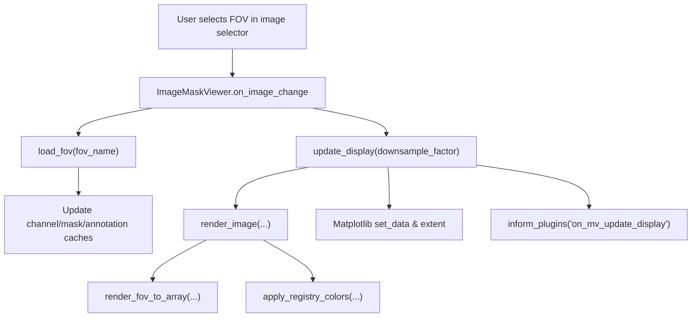

# FOV (image) load cycle — developer overview

This page documents how the viewer loads, caches, and renders a Field of View (FOV) at runtime. The focus is on the entry points inside `ueler/viewer/main_viewer.py` and the data structures they update.

## Event flow in context
- UI change: selecting a new FOV in `ui_components.image_selector` invokes `ImageMaskViewer.on_image_change`.
- `on_image_change` refreshes caches and widgets via `load_fov`, keeps selections in sync, and pushes navigation state when available.
- `update_display` recomputes the visible region, calls `render_image`, updates overlays, and notifies plugins via `inform_plugins('on_mv_update_display')`.

### `on_image_change(change)`
- Reads the active FOV from `self.ui_component.image_selector.value` and calls `load_fov(fov_name)` so channel, mask, and annotation assets exist in cache.
- Updates viewer geometry (`self.height`, `self.width`) from the first loaded channel and resizes `ImageDisplay` axes limits to match.
- Reconciles channel selections: preserves previously selected channels when possible, rebuilds color/contrast widgets, and clears stale controls.
- Syncs mask and annotation selectors: disables checkboxes for absent assets, refreshes palette metadata, and guards against missing widgets in notebook backends.
- Resets navigation state safely (`toolbar.push_current` or `_nav_stack` patching) and finally calls `self.inform_plugins('on_fov_change')`.

### `load_fov(fov_name, requested_channels=None)`
- Ensures channel metadata via `load_channel_struct_fov`; lazily materialises requested channels with `load_one_channel_fov`. Each load updates `channel_max_values` and re-syncs contrast sliders through `_sync_channel_controls`.
- Maintains `image_cache` as an `OrderedDict` implementing LRU eviction. When cache length exceeds `max_cache_size`, the least-recent FOV is removed.
- Loads masks with `load_masks_for_fov` when masks are available. For each mask it precomputes stride-based downsampled label arrays for every factor in `DOWNSAMPLE_FACTORS`, storing them in `label_masks_cache` (edge masks share a placeholder dict but are not generated by default).
- Loads annotations with `load_annotations_for_fov`, caches raw rasters in `annotation_cache`, and builds downsampled variants in `annotation_label_cache`. Palette/class metadata is updated via `apply_color_defaults` and stored in `annotation_palettes`, `annotation_class_labels`, and `annotation_class_ids`.
- Keeps `mask_names` and `annotation_names` sorted so widget option lists remain deterministic.

### `update_display(downsample_factor)`
- Uses `get_axis_limits_with_padding` to compute the visible pixel bounds (`xym`) and their downsampled equivalents (`xym_ds`). When no channels are selected it renders a black tile of the requested extent.
- Delegates rendering to `render_image`, supplying the selected channels, downsample factor, and viewport tuples. The returned RGB array is cached in `self.image_display.combined` and pushed into the Matplotlib artist (`set_data`/`set_extent`).
- Refreshes interaction caches when masks are active: `current_label_masks` and `full_resolution_label_masks` slice the relevant region for hit-testing/overlays before calling `ImageDisplay.update_patches()`.
- Notifies plugins via `inform_plugins('on_mv_update_display')`, then recomputes the scale bar (`update_scale_bar`) so the overlay length matches the active downsample factor.

### `render_image(selected_channels, downsample_factor, xym, xym_ds)`
- Calls `load_fov` again (idempotent) to guarantee requested channels are present. Determines exact viewport bounds based on `xym` or image shape fallbacks.
- Builds `ChannelRenderSettings` for each selected channel using current UI color selections (`predefined_colors`) and contrast sliders. These settings are passed to `render_fov_to_array` in `ueler/rendering/__init__.py`.
- Prepares annotation overlays when `annotation_display_enabled` is true. Downsampled rasters come from `annotation_label_cache`; colors derive from `build_discrete_colormap` using the active palette and alpha/mode sliders, encapsulated in an `AnnotationRenderSettings` object.
- Assembles mask overlays according to active mask checkboxes. Downsampled masks are read from `label_masks_cache`, wrapped in `MaskRenderSettings`, and rendered in outline mode with the viewer-wide `mask_outline_thickness`.
- Calls `collect_mask_regions` to gather per-mask label slices for the optional mask painter. After `render_fov_to_array` produces the base RGB tile, `apply_registry_colors` blends painter colors unless the painted IDs are currently highlighted.
- Returns the final `np.float32` RGB array ready for `update_display`.

## Cache structures & supporting fields
- `image_cache: OrderedDict[str, dict[str, np.ndarray | None]]` — lazily populated channel images per FOV; LRU-trimmed in `load_fov` and when cache size inputs change.
- `mask_cache` and `label_masks_cache` — raw masks plus stride-sampled versions keyed by downsample factor (`{1, 2, 4, ...}`). `edge_masks_cache` is primed for future edge generation but currently left empty.
- `annotation_cache` / `annotation_label_cache` — store full-resolution annotation rasters and their downsampled views; palette metadata lives in `annotation_palettes`, `annotation_class_labels`, and `annotation_class_ids`.
- `current_label_masks` / `full_resolution_label_masks` — short-lived selections scoped to the active viewport for interactive mask hover and click handling.
- `channel_max_values` — merged display maxima (`merge_channel_max`) referenced when rescaling intensities and reconfiguring UI sliders.

## Plugin and runner hooks
- Lifecycle notifications use `inform_plugins`, which iterates `self.SidePlots` entries and calls handlers such as `on_fov_change`, `on_mv_update_display`, and `on_marker_sets_changed` when available.
- The mask painter plugin reads `collect_mask_regions` output and cooperates with `apply_registry_colors` to tint labels after the core render pass.
- Notebook runners (`ueler/runner.py`) trigger `viewer.on_image_change(None)` and `update_display(...)` during refresh cycles; defensive guards prevent crashes when toolbars or plugins are still initialising.

This document is intentionally focused on the steady-state runtime behaviour. See also:
- `ueler/viewer/image_display.py` for canvas management and overlay patches.
- `ueler/rendering/__init__.py` for the channel compositing pipeline used by `render_image`.
- `ueler/viewer/plugin/` for plugin implementations that respond to viewer lifecycle events.
