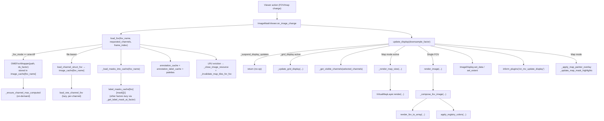

# FOV (image) load cycle — developer overview

This document captures how `ImageMaskViewer` (defined in `ueler/viewer/main_viewer.py`) loads, caches, and renders Field of View (FOV) data during an interactive notebook session. The emphasis is on the steady-state runtime path triggered when end users swap FOVs, pan/zoom, or toggle overlays.

## Event flow in context
- A viewer action (FOV dropdown, ROI navigation, map jump, etc.) drives `ImageMaskViewer.on_image_change`.
- `on_image_change` materialises FOV assets through `load_fov`, reconciles widget state, and normalises the Matplotlib toolbar history.
- `update_display` recomputes the viewport, chooses between stitched-map, channel-grid, and single-FOV rendering, feeds data to `ImageDisplay`, and notifies plugins.


```mermaid
flowchart TD
	UIEvent["Viewer action (FOV/map change)"] --> OnImageChange["ImageMaskViewer.on_image_change"]
	OnImageChange --> LoadFov["load_fov(fov_name, requested_channels, frame_index)"]
	LoadFov -->|_fov_mode == ome-tiff| OMEBranch["OMEFovWrapper(path, ds_factor)\nstored in image_cache[fov_name]"]
	LoadFov -->|file-based| FileChannel["load_channel_struct_fov → image_cache[fov_name]"]
	OMEBranch --> EnsureMax["_ensure_channel_max_computed (on-demand)"]
	FileChannel --> LoadOneCh["load_one_channel_fov (lazy, per-channel)"]
	LoadFov --> MaskLoad["_load_masks_into_cache(fov_name)"]
	MaskLoad --> LazyPyramid["label_masks_cache[fov][mask][1]\n(other factors lazy via _get_label_mask_at_factor)"]
	LoadFov --> AnnotationCache["annotation_cache + annotation_label_cache + palettes"]
	LoadFov --> Evict["LRU eviction → _close_image_resource\n+ _invalidate_map_tiles_for_fov"]
	OnImageChange --> UpdateDisplay["update_display(downsample_factor)"]
	UpdateDisplay -->|_suspend_display_updates| EarlyExit["return (no-op)"]
	UpdateDisplay -->|_grid_display active| GridDisplay["_update_grid_display(...)"]
	UpdateDisplay --> VisibleCh["_get_visible_channels(selected_channels)"]
	UpdateDisplay -->|Map mode active| RenderMap["_render_map_view(...)"]
	RenderMap --> VirtualLayer["VirtualMapLayer.render(...)"]
	UpdateDisplay -->|Single FOV| RenderImage["render_image(...)"]
	RenderImage --> Compose["_compose_fov_image(...)"]
	Compose --> RenderCore["render_fov_to_array(...)"]
	Compose --> Painter["apply_registry_colors(...)"]
	UpdateDisplay --> Artist["ImageDisplay.set_data / set_extent"]
	UpdateDisplay --> PluginNotify["inform_plugins('on_mv_update_display')"]
	UpdateDisplay -->|Map mode| MapPainter["_apply_map_painter_overlay\n_update_map_mask_highlights"]
```

## `ImageMaskViewer.on_image_change(change)`
- Reads the active FOV from `self.ui_component.image_selector.value` (or receives `None` during initial wiring) and invokes `load_fov` so the channel dictionary is populated.
- Updates geometry (`self.width`, `self.height`) by consulting `OMEFovWrapper.shape` directly when the cache entry is an `OMEFovWrapper`; otherwise falls back to inspecting the shape of the first loaded channel array. Both paths mirror dimensions into `ImageDisplay` and reset axis limits to `[0, width] × [height, 0]` to honour the inverted Y axis.
- Rebuilds channel controls: preserves the previous multi-select when channel names still exist, otherwise falls back to a first-channel default (when a cell table is present) or an empty tuple. It also prunes colour, contrast, and visibility widgets belonging to channels no longer available.
- Enables/disables mask widgets per FOV availability by consulting `self.mask_cache`; the UI leaves colour pickers intact but toggles their `disabled` flag.
- Refreshes annotations when the dataset exposes rasters: updates selector options, maintains `self.active_annotation_name`, and disables the display toggle when no annotation is loaded. Additional palette metadata (`annotation_palettes`, `annotation_class_labels`) is kept in sync via `_refresh_annotation_control_states`.
- Calls `self.update_controls(None)` to rebuild accordion sections, then coordinates with plugins: clears heatmap patches when not linked, replays chart highlights, and lets wide plugins reconcile state after the FOV hop.
- Normalises the Matplotlib navigation stack by patching `_nav_stack._elements` when present, or by falling back to `toolbar.push_current()` so Reset view keeps working after FOV changes.
- When `_grid_display` is active and the viewer is initialised, also calls `_update_grid_display(self.current_downsample_factor)` so channel grid panes refresh for the new FOV.
- Emits `inform_plugins('on_fov_change')` so side-panel extensions can refresh without polling viewer state.

## `ImageMaskViewer.load_fov(fov_name, requested_channels=None, frame_index=None)`

### Image loading — file-based vs. OME-TIFF paths

`load_fov` accepts an optional `frame_index` argument for multi-frame OME-TIFFs; when absent, it looks up `self.frame_index_by_fov` first, then falls back to `self.current_frame_index`.

**OME-TIFF path** (`self._fov_mode == "ome-tiff"` and FOV not yet in `image_cache`):
- Searches `self.base_folder` for files matching `<fov_name>.ome.tif*`, `<fov_name>.tif(f)` and deduplicates candidates.
- Opens the first match as an `OMEFovWrapper(path, ds_factor=self.current_downsample_factor)`. The wrapper builds a multi-resolution pyramid from the TIFF series and detects a frame axis (T/Z) for time/Z-stack navigation.
- Stores the wrapper directly in `image_cache[fov_name]` (wrapper acts as a dict-like: `wrapper[channel_name]` returns a lazy dask array for the current frame/level).
- Persists frame state in `self.frame_index_by_fov[fov_name]` and OME metadata in `self.ome_fov_metadata[fov_name]`.
- **Channel max values are not computed at load time** to avoid memory spikes. They are requested on-demand per channel through `_ensure_channel_max_computed`.

**File-based path** (regular per-channel TIFF files):
- Calls `load_channel_struct_fov` to create a `{channel_name: None}` stub dict and stores it in `image_cache[fov_name]`.
- For each channel in `requested_channels`, loads the array lazily via `load_one_channel_fov` if still `None`. This call also calls `_sync_channel_controls` to keep slider ranges accurate.

On every access, `image_cache.move_to_end(fov_name)` keeps LRU order current. When `len(image_cache) > self.max_cache_size`, the least-recent entry is popped and `_close_image_resource` is called (which invokes `.close()` on `OMEFovWrapper` objects to release file handles) followed by `_invalidate_map_tiles_for_fov`.

### `_ensure_channel_max_computed(fov_name, channel_name)`
Called for every requested channel on the OME-TIFF path. Reads the channel array from the wrapper, computes `arr.max().compute()` (single Dask call), and merges the result into `channel_max_values` via `merge_channel_max`. Skips the computation if the channel is already present in `channel_max_values`.

### Mask loading

`_load_masks_into_cache(fov_name)` is the central mask-loading helper (extracted from the old inline code). It is skipped when the FOV is already in `mask_cache` (only LRU order is refreshed). New behaviour:
- Calls `load_masks_for_fov` to read `fov_mask_*.tif(f)` files.
- **Phase 4 lazy pyramid**: only the full-resolution array (`factor=1`) is stored in `label_masks_cache[fov_name][mask_name]` at load time. All other downsample levels are computed on first access via `_get_label_mask_at_factor`.
- Empty or zero-size masks are warned and skipped.
- In **map mode**, mask loading is skipped entirely when no mask overlay checkbox is ticked, avoiding unnecessary I/O for map panning.
- Same LRU eviction semantics as `image_cache`: when `len(mask_cache) > max_cache_size`, the oldest FOV is removed and its `edge_masks_cache`/`label_masks_cache` entries are cleaned up.

### `_get_label_mask_at_factor(fov_name, mask_name, factor)`
Returns the downsampled label array for a given factor, computing and caching it on first access:
```python
factor_dict[factor] = full_res[::factor, ::factor]
```
Returns `None` when the mask or FOV is not in the cache, making callers safe to check for `None`.

### Annotation loading
- Fetches annotations through `load_annotations_for_fov`. Raw rasters live in `annotation_cache[fov_name]`, downsampled slices are cached in `annotation_label_cache[fov_name][annotation][factor]`, and palette metadata is merged into `annotation_palettes`, `annotation_class_ids`, and `annotation_class_labels` using `apply_color_defaults`. Annotation names are gathered into `self.annotation_names` (sorted for deterministic widget options).
- Reorders `annotation_cache` on every access so eviction continues to honour LRU semantics.

## `ImageMaskViewer.update_display(downsample_factor)`
- **Early exit guards**: returns immediately when `self._suspend_display_updates` is `True` (set during viewer initialisation to suppress redundant redraws) or when `self._grid_display` is set — in the latter case, it delegates entirely to `_update_grid_display(downsample_factor)` for channel-grid rendering.
- Uses `get_axis_limits_with_padding(self, downsample_factor)` to convert the current Matplotlib viewport into pixel-space (`xym`) and downsampled (`xym_ds`) coordinates. The helper also records `_last_viewport_px` for stitched-map hit testing.
- Resolves **visible channels** by first reading `self.ui_component.channel_selector.value` and then filtering through `_get_visible_channels(selected_channels)`. This step respects per-channel visibility checkboxes (`channel_visibility_controls`) so hidden channels are never forwarded to the renderer. `_refresh_channel_legend` is also called here to keep the legend in sync.
- When no channels are visible, renders a zeroed array matching the downsampled viewport extent and skips further work.
- If map mode is active (`self._map_mode_active`), delegates to `_render_map_view`. The helper forwards viewport bounds (translated into microns) to `VirtualMapLayer`, receives a stitched RGB tile, resets `current_label_masks`/`full_resolution_label_masks`, and tracks which FOV tiles were visible (`_visible_map_fovs`). After blitting, `_apply_map_painter_overlay` and `_update_map_mask_highlights` are called (errors are swallowed unless `self._debug`).
- Otherwise, calls `render_image(visible_channels, downsample_factor, xym, xym_ds)` to produce a single-FOV RGB composite, then derives `current_label_masks` by calling `_get_label_mask_at_factor` for each enabled mask (lazy pyramid). Full-resolution versions are populated whenever `factor=1` data is available so mask painters and pixel inspectors can reuse them. `ImageDisplay.update_patches()` is called when available to refresh overlay artists.
- Updates `ImageDisplay` via `set_data` and `set_extent`, repaints the canvas, and triggers `inform_plugins('on_mv_update_display')`. It finishes by recalculating the scale bar (`update_scale_bar`).

## `_compose_fov_image(...)` and `render_image(...)`
- `render_image` normalises viewport tuples, guarantees channel data exists by re-invoking `load_fov`, and falls back to the full image extent when `xym` is `None`. It computes downsampled indices when `xym_ds` is missing, then delegates to `_compose_fov_image`.
- `_compose_fov_image` assembles render settings:
	- Channel settings pull colour choices from `self.ui_component.color_controls`, convert them to RGB via `matplotlib.colors.to_rgb`, and thread per-channel contrast bounds from `contrast_min_controls`/`contrast_max_controls`.
	- Annotation overlays respect `self.annotation_display_enabled` and `self.active_annotation_name`. Downsampled rasters come from `annotation_label_cache`; colour maps are generated with `build_discrete_colormap` using the palette merged during `load_fov`. Alpha and mode reflect the annotation control widgets.
	- Mask overlays gather enabled masks, fetch or lazily slice `label_masks_cache`, and wrap each array in `MaskRenderSettings` with the global `mask_outline_thickness`. `collect_mask_regions` derives per-mask label slices (downsampled) so the mask painter can recolour rendered pixels later.
- The assembled configuration is rendered through `render_fov_to_array`, yielding a `float32` RGB tile in downsampled coordinates. If the mask painter plugin is active, `apply_registry_colors` infuses per-label colours (excluding currently selected IDs) before the composite is returned to `update_display`.

## Cache structures & derived state
- `image_cache: OrderedDict[str, Dict[str, dask.array] | OMEFovWrapper]` — channel rasters keyed by FOV. For file-based datasets the value is a plain dict; for OME-TIFF datasets it is an `OMEFovWrapper` that exposes a dict-like interface (`wrapper[channel_name]` → dask array). Accompanies `channel_max_values` storing per-channel max intensities for slider bounds.
- `frame_index_by_fov: Dict[str, int]` — persists the active frame index for each OME-TIFF FOV across load/render calls. `ome_fov_metadata[fov_name]` stores parsed OME XML or TIFF metadata for the same FOVs.
- `mask_cache: OrderedDict[str, Dict[str, array-like]]` with accompanying `label_masks_cache[fov][mask][factor]` (lazy pyramid — only `factor=1` pre-populated; others computed on demand by `_get_label_mask_at_factor`) and `edge_masks_cache` placeholders for outline rasters.
- `annotation_cache: OrderedDict[str, Dict[str, array-like]]` alongside `annotation_label_cache[fov][annotation][factor]`, `annotation_palettes`, `annotation_class_ids`, and `annotation_class_labels` (palette/label metadata synced across FOVs).
- Runtime interaction fields include `current_label_masks` and `full_resolution_label_masks` (populated per render for hit-testing and painters), `_visible_map_fovs` (recent stitched tiles), and `_map_tile_cache` (shared between map descriptors).
- `_suspend_display_updates: bool` — set to `True` during viewer initialisation to prevent redundant `update_display` calls while widget state is being restored.

## Map mode integration (feature-flagged)
- `ENABLE_MAP_MODE` is read at import time; when truthy, `__init__` calls `_initialize_map_descriptors` to ingest `<base_folder>/.UELer/maps/*.json` via `MapDescriptorLoader`. Warnings and errors are surfaced through `_record_map_mode_warning` and logged.
- Each descriptor spawns a `VirtualMapLayer` on demand. The viewer shares `self._map_tile_cache` (an `OrderedDict`) with all layers and caps it via `self._map_tile_cache_capacity` (default six tiles). Cache keys incorporate the FOV name, downsample factor, selected channels, render region, and an optional `_map_state_signature` snapshot (captures channel colours, contrast bounds, annotation + mask state, and outline thickness) so UI tweaks invalidate stitched tiles automatically.
- `update_display` routes through `_render_map_view` whenever `self._map_mode_active` and `self._active_map_id` are set. The helper converts pixel viewports to micron coordinates using descriptor bounds, calls `VirtualMapLayer.set_viewport(...)`, then blits the composite back into the regular display pipeline.
- Evicting a FOV from `image_cache` or mutating its contents triggers `_invalidate_map_tiles_for_fov`, ensuring stitched renders never reuse stale channel or overlay data.

## Plugin and runner hooks
- `inform_plugins` iterates every attribute on `self.SidePlots`; any object deriving from `PluginBase` receives lifecycle callbacks (`on_fov_change`, `on_mv_update_display`, `on_marker_sets_changed`, etc.) if it implements them. This mechanism keeps the chart, heatmap, gallery, export, and painter plugins synchronised with viewer state without direct coupling.
- `update_scale_bar`, `_notify_plugins_mask_outline_changed`, and `_notify_plugins_pixel_size_changed` provide additional targeted hooks invoked from the load/render cycle when relevant properties change.

## Related modules
- `ueler/viewer/image_display.py` — manages Matplotlib artists, patches, and scale bar rendering consumed by `update_display`.
- `ueler/rendering/__init__.py` — defines `render_fov_to_array`, `ChannelRenderSettings`, `MaskRenderSettings`, `AnnotationRenderSettings`, and overlay blending used by `_compose_fov_image`.
- `ueler/viewer/virtual_map_layer.py` — stitches tiled FOVs for map mode and caches per-tile composites.
- `ueler/data_loader.py` — channel, mask, and annotation loaders used by `load_fov` along with statistics helpers for contrast sliders. Also defines `OMEFovWrapper`, which wraps a `tifffile.TiffFile` as a dict-like channel accessor with multi-resolution pyramid and frame-axis support.
