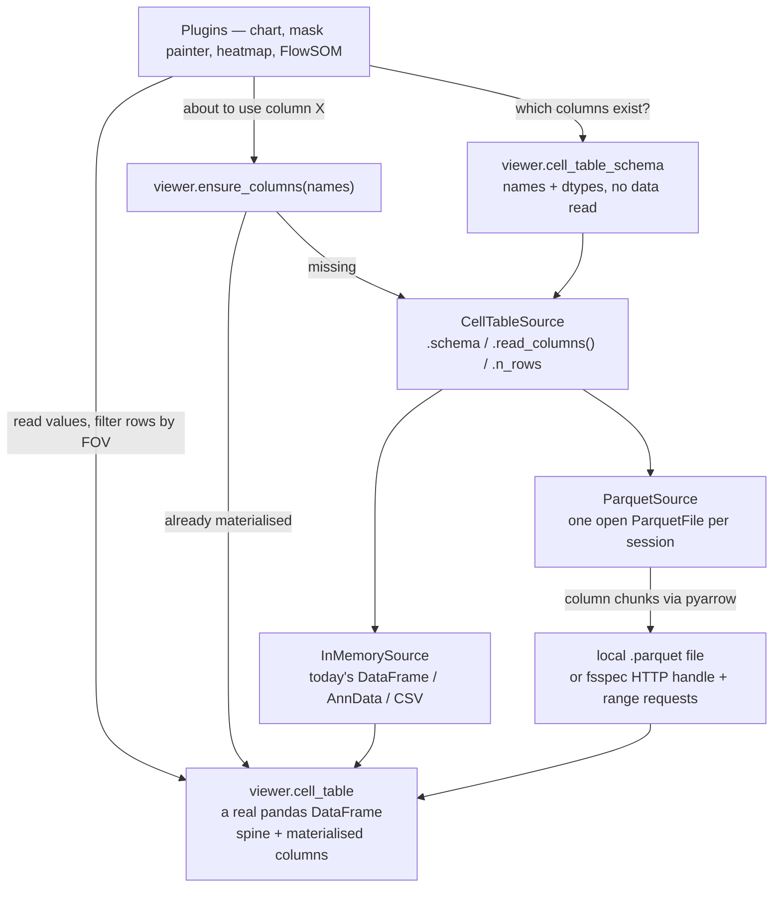
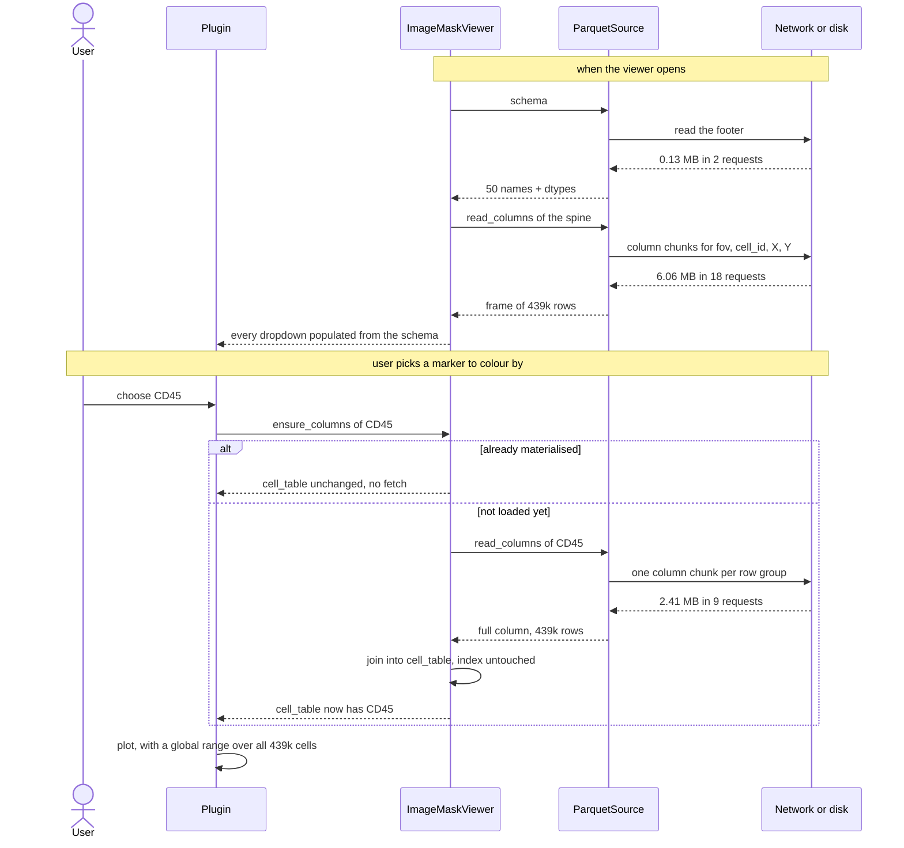
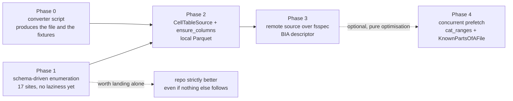

# Plan — a Parquet-backed, column-lazy cell table

Status: **implemented**, as a follow-up to issue #140. Phases 0–4 all landed; see [What was built](#what-was-built) for the measured result and for the three places the plan turned out to be wrong.

## Problem

UELer loads a cell table in one shot: `load_cell_table_from_path` runs `pd.read_csv` (or `read_h5ad`) and hands the whole frame to `set_cell_table`. For a study-scale table that is the wrong shape in three ways at once, all of them visible on `S-BIAD2557`'s `pCSL005_cell_table.csv`:

* **361 MB over the wire before anything renders**, and roughly 5 minutes on a modest link. The BIA path added in #140 can restrict the rows to a set of FOVs, but a CSV has no index, so the whole remote file is still read to find them.
* **402 MB resident** once pandas has parsed it, against the ~2 GB a free Binder container has to share with the image cache.
* **All or nothing.** The viewer needs the column names and dtypes immediately, to populate every marker/annotation dropdown in the GUI; it needs a handful of columns (`fov`, cell label, `X`, `Y`) to locate cells; and it needs whichever single column a plot is about. It currently pays for all fifty to get any of them.

Parquet fixes the transport. The work is almost entirely in the **reading mechanism** and in the ~17 places in the viewer that assume `viewer.cell_table` holds every column.

## Evidence

All figures measured on the real table (439,339 rows × 50 columns), converted to float32 with categorical string columns, served over a local HTTP server with byte-accurate accounting and real range support. One file handle held open for the session, so the footer is paid once.

| access pattern | 455 row groups (one per FOV) | 33 row groups | 9 row groups |
| --- | --- | --- | --- |
| schema — names + dtypes, no data | 2.36 MB / 2 reqs | 0.26 MB / 2 reqs | **0.13 MB / 2 reqs** |
| spine (`fov`, `cell_id`, `X`, `Y`), all rows | 7.30 MB / 455 reqs | 5.99 MB / 66 reqs | **6.06 MB / 18 reqs** |
| one full marker column, all rows | 2.22 MB / **455 reqs** | 2.35 MB / 33 reqs | **2.41 MB / 9 reqs** |
| a 12-FOV slice, 8 columns | **0.41 MB** / 13 reqs | 4.12 MB / 24 reqs (155k rows, over-fetched) | 1.49 MB / 3 reqs |
| whole table, every column | 91 MB | 93 MB | 95 MB |

Sizes on disk: 361 MB CSV → 159 MB Parquet (float64) → **91 MB** (float32 + dictionary-encoded strings). In memory the same table is ~90 MB against 402 MB for the CSV load, so the whole thing now *fits*; laziness buys latency, not feasibility.

Three findings shaped the design:

* **Round trips dominate, not bytes.** At a WAN's ~20–100 ms, a full column out of a FOV-partitioned file costs 455 requests — 12 s in the harness, far worse than the 2.2 MB suggests. Fine row groups optimise the access pattern we turn out not to need.
* **If every materialised column is complete, there is never a per-FOV read.** That deletes the entire row-pruning problem, and with it the row-group statistics logic, the per-FOV cache keys, and the correctness hazard recorded below. Row groups should therefore be **coarse (8–32)**, sized for sequential column scans.
* **Dask does not help here.** `dd.read_parquet(url, columns=[...]).compute()` fetched **~282–288 MB — three times the whole file — to read one 2.2 MB column**, in both layouts and with `storage_options={"cache_type": "none"}`. `pre_buffer=True` + `use_threads` on pyarrow changed nothing through an fsspec file handle. The concurrency win the question points at is real but belongs to fsspec: `fs.cat_ranges` fetched the same column in **0.28 s / 2.22 MB**, a 43× speed-up with exact bytes.

## Design

**Column-lazy, row-complete.** `viewer.cell_table` stays a genuine `pandas.DataFrame` for its whole life. It starts as the spine and *gains whole columns*; rows are never dropped and the index never changes.

Three consequences, and they are the reason for this shape rather than a lazier one:

1. Every existing row-filter keeps working untouched — the 12 sites of `cell_table[fov_key] == current_fov` in `chart.py`, `mask_painter.py` and friends, plus every `.loc`, boolean mask and `.to_numpy()` call.
2. Global statistics stay **exact**. [`MaskPainter._compute_auto_range`](../../ueler/viewer/plugin/mask_painter.py) computes a global percentile range over `cell_table[column]` for continuous colouring; the heatmap, FlowSOM and the histogram gates are equally whole-table. A row-lazy table would silently redefine all of them as "over the FOVs you happen to have opened", and the mask colours would shift as the user browsed. Row-complete columns make that class of bug impossible rather than merely unlikely.
3. No new execution model, no `.compute()`, no persisted graphs. The only new idea is "this column is not here yet".

### Components

* **`ueler/cell_table_source.py`** (new) — a small protocol plus two implementations.
  * `CellTableSource`: `.schema` → ordered `{name: dtype}`; `.n_rows`; `.read_columns(names) -> DataFrame`; `.close()`.
  * `InMemorySource(df)` — wraps an already-materialised frame, so today's CSV/AnnData/DataFrame paths become the degenerate case of the new one and keep working with no branch anywhere else.
  * `ParquetSource(path_or_file)` — holds one open `pq.ParquetFile` for the session and reads column chunks on demand. Takes a local path or an open file object, which is what lets the BIA case reuse it verbatim.
* **`ImageMaskViewer.cell_table_schema`** — the source of truth for *what columns exist*, available before any data is read. Deliberately **not** named `cell_table_columns`: that attribute already exists and holds AnnData provenance for `sync_cell_table_to_obs` (#123).
* **`ImageMaskViewer.ensure_columns(names)`** — materialises any missing columns into `viewer.cell_table` and returns the frame. Idempotent, cached, a no-op for an `InMemorySource`. This is the single entry point for laziness.

### The read path

The mechanism in full, with the measured cost of each fetch. Note what is *not* here: no per-FOV read, no row filtering, no recomputation — a column is fetched once, complete, and stays.

### The call sites

17 cell-table sites across 6 files enumerate or test `cell_table.columns` (two further hits in `roi_manager_plugin.py` are the ROI table, not the cell table). They split into two kinds, and the second is the hazard:

* **Enumeration** — `run_flowsom.py:69`, `chart.py:782`, `_chart_common.py:77,298`, `cell_table.py:478`. These populate dropdowns and must read `cell_table_schema`, or the GUI will offer a list that shrinks to whatever happens to be loaded.
* **Membership guards** — `_chart_common.py:56,62,137`, `mask_painter.py:344,372,1594,1665,1746`, `heatmap_layers.py:532,538,573,581`. Each is a `col in cell_table.columns` check *before using the column*. Against a lazy table these silently answer "no" for a column that exists but is not materialised, and the plugin quietly draws nothing. Each must become a schema test plus an `ensure_columns` call.

Missing one of these is the realistic failure mode, so Phase 1 converts them **before** any laziness exists, when the schema is simply derived from the frame and the behaviour is provably identical.

## Phases

Each phase ends green and is reviewable on its own.

### Phase 0 — the converter

`tools/cell_table_to_parquet.py`: CSV/`.h5ad` → the UELer Parquet layout. Sorts by the FOV column, casts floats to float32 (opt-out flag), dictionary-encodes low-cardinality strings, writes N row groups on FOV boundaries (default 16), zstd. Prints the resulting size and per-column footprint. This produces both the file to upload to BIA and the test fixtures.

### Phase 1 — schema-driven column enumeration (no laziness)

Add `cell_table_schema`, derived from the frame; convert all 17 sites; suite must stay green with **no behaviour change**, since every column is still present. This is the risky refactor, done in isolation where it is cheap to verify.

### Phase 2 — `CellTableSource` + `ensure_columns`, local Parquet

Add the module, teach `load_cell_table_from_path` a `.parquet` branch, materialise the spine at load, wire `ensure_columns` into the membership guards and the dropdown observers. A local Parquet file is now opened lazily; everything else is unchanged.

**Guard against a missed site:** in `debug=True` the viewer wraps the frame so that touching a column that is in the schema but not materialised logs a warning naming the caller. Cheap, catches the failure mode during testing, and keeps network I/O out of `DataFrame.__getitem__` in production — a subclass that fetches inside `__getitem__` was considered and rejected, because pandas calls it from copy, slice and merge paths where a blocking HTTP read has no business happening.

### Phase 3 — the remote source (BIA)

`fetch_cell_table` gains a Parquet branch returning a `ParquetSource` over an fsspec handle instead of a local path, with the handle held for the session. The descriptor's `cell_table` key needs no new syntax — the suffix decides. `run_viewer_bia(..., cell_table=True)` then opens with the spine only.

### Phase 4 — optional: concurrent prefetch

`fs.cat_ranges` for the column chunks, seeded into `fsspec.caching.KnownPartsOfAFile` so pyarrow reads from a warm cache. Measured 43× on the pathological layout and ~8× on the recommended one. Entirely behind `read_columns`, so it changes no interface and can be deferred or dropped.

## Testing

* Unit tests against a Parquet fixture from Phase 0: schema without data, `ensure_columns` idempotence and caching, a guard site that now materialises, `InMemorySource` equivalence with today's behaviour.
* A **counterweight** to the byte budgets: reading all the columns must fetch the whole file. Without it every budget below could pass while the harness measured nothing at all. (This is not hypothetical — the first version of the server counted the declared `Content-Length` rather than what it wrote, and fsspec's unranged size probe made an 894 KB file look like a 1.85 MB read.)
* **Byte-budget tests.** The range-supporting HTTP server written during this investigation becomes a test helper, and the tests assert *bytes fetched* — opening a viewer must cost less than the spine plus footer, and reading one column must not fetch the file. This is the only way the property stops silently regressing: a single stray `.columns` call that materialises everything is invisible to every other kind of test.
* The full suite (`tools/run_test_suite.py --max-skips 0`, currently 1229) stays green at every phase.

## Risks and open questions

* **`pyarrow` becomes a declared dependency.** It is only present transitively today.
* **Whole-table consumers must materialise everything.** `get_cell_table_adata()` builds `X` from "the numeric columns that are not viewer keys", and the checkpoint store writes that AnnData to `.h5ad`; batch export and `sync_cell_table_to_adata` are the same shape. Each needs an explicit `ensure_columns(all)`, and on a remote source that is a real ~90 MB wait that should say so in the status bar rather than appearing to hang.
* **Edited and plugin-added columns** (FlowSOM clusters, heatmap meta-clusters, `cell_table_editor`) live only in the in-memory frame. They must survive `ensure_columns` joins — the implementation adds columns to the existing frame rather than rebuilding it, but this needs an explicit test.
* **Row order.** The spine defines the index; every later column must be read in the same row order. Reading whole row groups in file order guarantees it, but any future row filtering would break the assumption, which is a further argument for row-complete.
* **AnnData input is unaffected** and stays eager; `.h5ad` over HTTP is a different problem and is out of scope.

## Out of scope

Row-lazy loading, per-FOV cell-table fetching, OME-Zarr, and any change to how the images stream. Dask, for the reasons measured above.

## What was built

All five phases landed together. The measurements below are end to end against `S-BIAD2557`'s real cell table — the 12-FOV subset cached by #140, 14,344 rows × 50 columns — converted by `tools/cell_table_to_parquet.py` and served over the test suite's range-supporting HTTP server with 25 ms of artificial latency per request, which is what a WAN costs.

| step | wall clock | bytes fetched | share of the file |
| --- | --- | --- | --- |
| open the viewer (footer + spine, 50 column names and dtypes known) | 0.35 s | 340 KB | 11.4% |
| materialise one marker column (`CD45`, all 14,344 rows) | 0.04 s | 72 KB | 2.4% |
| ask for the same column again | 0.00 s | 0 B | — |
| materialise a class column (`lineage_level1`, dictionary encoded) | 0.04 s | 8 KB | 0.3% |
| materialise everything (`ensure_all_columns`) | 0.66 s | 2.73 MB | 91.9% |

12.4 MB of CSV became 2.97 MB of Parquet, and the global range over `CD45` is exact across every row because a materialised column is always complete.

### Three corrections to the plan

* **`cell_table.py:478` is not an enumeration site.** It is inside `dataframe_to_anndata`, a whole-table consumer, and converting it to a schema lookup would have been wrong. It was left alone and its caller, `get_cell_table_adata`, now calls `ensure_all_columns()` instead. The same goes for `heatmap_layers.py:573,581`, which test columns the plugin has *just written* into the frame.
* **The two `mask_painter.py` guards on the render path stay frame tests.** `build_painter_state_maps_for_fov` runs for every FOV render, and a blocking column read has no business there. The materialisation happens where the user *picks* the column — the dropdown observer and the auto-range handlers — which is both earlier and once. The plan's "each must become a schema test plus an `ensure_columns` call" was too uniform.
* **Phase 4's first implementation made things worse.** Warming the cache by opening a *second* `ParquetFile` over the seeded handle re-read the footer on every column read, and on a 50-column table the footer (90 KB) is larger than a column (70 KB) — so the "optimisation" roughly doubled the cost. Seeding the cache on the session handle instead, and standing aside entirely when the requested columns cover more than half the file, made it byte-exact: 4× faster than the sequential path at 25 ms latency and never slower. There is also a trap worth recording: `fsspec.caching.KnownPartsOfAFile` **pops** the entries out of the dict it is handed while consolidating contiguous blocks, so that dict is empty by the time the caller looks at it.

### What shipped

* `ueler/cell_table_source.py` — `CellTableSource`, `InMemorySource`, `ParquetSource`, `open_parquet_source`, the `cat_ranges` prefetch, and the debug `_GuardedFrame`.
* `tools/cell_table_to_parquet.py` — the converter, defaults as specified (float32, 16 row groups, FOV-sorted, zstd, dictionary-encoded strings) plus a per-column footprint report.
* `ueler/cell_table.py` — `table_schema`, `table_columns`, `table_has_column`, `ensure_table_columns`, and `categorical_columns` extended to accept a schema mapping.
* `ImageMaskViewer` — `cell_table_schema`, `cell_table_source`, `unmaterialised_columns`, `ensure_columns`, `ensure_all_columns`, `set_parquet_cell_table`, a `.parquet` branch in `load_cell_table_from_path`, and `set_cell_table(..., source=)`.
* `BIADataSource.cell_table_is_parquet` / `open_cell_table_source`, and `runner._attach_bia_cell_table` behind both `run_viewer_bia(cell_table=True)` and `load_bia_cell_table`.
* `tests/test_issue141_cell_table_parquet.py` — 48 tests, including the byte budgets and a counterweight test that fails if the harness stops measuring.

## Filing

Raised in chat as a follow-up to issue #140 rather than as a new issue, so it is recorded as a Follow-Up Request in `dev_note/github_issues.md` under #140 and tracked here.
