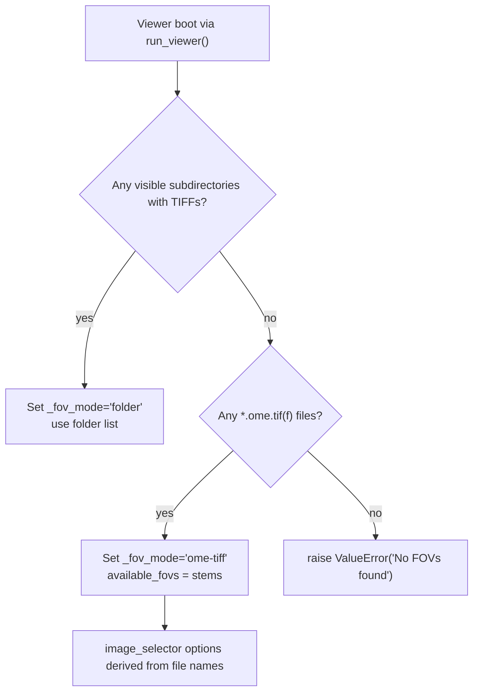
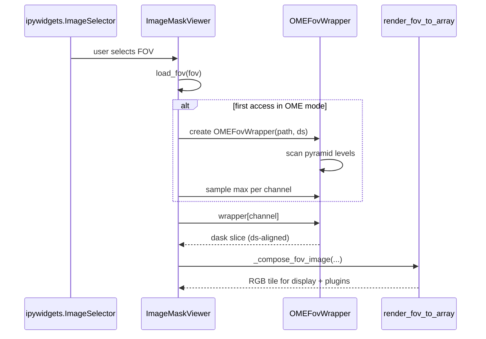

# OME-TIFF Loading Pipeline

## Overview
The viewer can operate in either the legacy *folder-per-FOV* layout or a native OME-TIFF mode. When a dataset directory contains `.ome.tif` / `.ome.tiff` files instead of per-channel folders, `ImageMaskViewer` automatically switches into OME mode, wraps each file in `OMEFovWrapper`, and reuses the existing rendering pipeline without modifying overlay or plugin code. This note documents how detection works, how the wrapper slices multi-resolution pyramids, and how viewer state (downsample factors, caches, channel maxima) stays synchronized.

## Relevant Files and Notebooks
- [ueler/viewer/main_viewer.py#L205-L360](ueler/viewer/main_viewer.py#L205-L360) — dataset bootstrapping, `_fov_mode` detection, widget init.
- [ueler/viewer/main_viewer.py#L1257-L1425](ueler/viewer/main_viewer.py#L1257-L1425) — `on_downsample_factor_changed()` and `load_fov()` logic that integrates `OMEFovWrapper` with caches and channel maxima.
- [ueler/data_loader.py#L254-L420](ueler/data_loader.py#L254-L420) — `_ensure_*` helpers, `extract_ome_channel_names()`, `open_ome_tiff_as_dask()`, and the `OMEFovWrapper` implementation (level selection, slicing, caching).
- [tests/test_ome_tiff_loading.py](tests/test_ome_tiff_loading.py) — unit coverage for channel-name extraction, pyramid-level selection, cache invalidation, and file-handle cleanup.
- [tests/test_ome_rendering_fix.py](tests/test_ome_rendering_fix.py) — regression coverage for coordinate and shape handling when rendering across pyramid levels.
- [script/run_ueler_OMETiff.ipynb](script/run_ueler_OMETiff.ipynb) — launch notebook that sets up an OME-TIFF dataset directory and exercises the viewer in OME mode.

## Dataset Mode Detection
`ImageMaskViewer.__init__()` scans the `base_folder` once during construction. Subdirectories with TIFF channels keep the default "folder" mode; if no valid FOV directories exist but `.ome.tif(f)` files are present, `_fov_mode` flips to `"ome-tiff"` and `available_fovs` is populated from file stems ([ueler/viewer/main_viewer.py#L214-L248](ueler/viewer/main_viewer.py#L214-L248)). Hidden folders such as `.UELer` are ignored so that metadata directories do not block detection. The resulting FOV list feeds the `image_selector` widget just like the legacy path.

## OMEFovWrapper Structure
The wrapper encapsulates a single OME-TIFF file and exposes a dict-like interface:
- **Metadata**: `extract_ome_channel_names()` reads the OME-XML via `tifffile.TiffFile().ome_metadata`, falling back to channel IDs when names are missing ([ueler/data_loader.py#L306-L339](ueler/data_loader.py#L306-L339)).
- **Pyramid awareness**: `_init_levels()` inspects `tifffile` series levels, recording axes, shapes, and relative scale per resolution tier. `_select_level()` chooses the coarsest level whose native scale does not exceed the requested downsample factor and returns a residual stride (`ceil(ds_factor / level.scale)`).
- **Lazy data access**: `_get_level_array()` retrieves the selected level via `series.aszarr(level=...)` and wraps it with `dask.array.from_zarr`, so no full-resolution read happens. `__getitem__()` caches `(channel_name, ds_factor)` slices to avoid repeated work and only applies numeric downsampling through slice strides.
- **Resource lifecycle**: `set_downsample_factor()` clears cached slices when the viewer zoom changes; `close()` releases the underlying `tifffile` handle so image cache eviction does not leak descriptors.

## Loading Pipeline and Callbacks
1. **User action**: selecting a FOV in `ui_component.image_selector` triggers `ImageMaskViewer.on_image_change()`, which calls `load_fov()` with the selected name.
2. **Wrapper instantiation**: if `_fov_mode == "ome-tiff"` and the cache lacks that FOV, `load_fov()` resolves `<fov>.ome.tif(f)`, instantiates `OMEFovWrapper(path, ds_factor=current_downsample_factor)`, and stores it in `image_cache` ([ueler/viewer/main_viewer.py#L1306-L1347](ueler/viewer/main_viewer.py#L1306-L1347)).
3. **Channel maxima**: for every `wrapper.get_channel_names()`, the viewer evaluates `arr.max().compute()` on the **downsampled** array and feeds the result into `merge_channel_max()` so contrast sliders remain accurate even for lazy data.
4. **Lazy channel fetch**: subsequent code treats `image_cache[fov_name]` as mapping-like. When `render_image()` asks for a specific channel, `OMEFovWrapper.__getitem__()`
   - selects the correct pyramid level,
   - slices the requested channel, and
   - applies any residual stride so the array already matches the viewer's downsample factor.
5. **Rendering**: `_compose_fov_image()` receives the downsampled dask arrays and passes them into `render_fov_to_array()`. No OME-specific branches exist beyond the wrapper itself, so annotations, masks, and plugins continue to function.

## Downsample and State Management
- **Downsample factor propagation**: `on_downsample_factor_changed()` updates `current_downsample_factor` and calls `set_downsample_factor()` on every cached `OMEFovWrapper`, which flushes its per-channel cache so subsequent accesses pick matching pyramid levels ([ueler/viewer/main_viewer.py#L1257-L1284](ueler/viewer/main_viewer.py#L1257-L1284)).
- **Image cache**: `image_cache` remains an `OrderedDict`; in OME mode each entry is the wrapper itself. Eviction closes the underlying file via `_close_image_resource()` so OS file descriptors remain bounded.
- **Channel maxima**: the viewer keeps the existing `channel_max_values` map. Even though the wrapper only yields downsampled arrays, the 99.9th percentile vs dtype max logic in `_update_channel_max()` still holds because it runs on the returned dask chunk.
- **Masks / annotations**: mask and annotation caches do not change—these assets are still loaded from sibling directories when provided, so OME support is backwards-compatible with existing overlay pipelines.

## Viewport Dimensions and Full-Image Zoom
- **Where width/height come from**: after the very first `load_fov()` call, `ImageMaskViewer.__init__()` pulls the first channel array from the cache and does `self.height, self.width = first_channel_image.shape` ([ueler/viewer/main_viewer.py#L270-L279](ueler/viewer/main_viewer.py#L270-L279)). This happens before any UI interaction, so whatever array shape is available at that moment becomes the canonical canvas extent.
- **Implication for OME mode**: when `_fov_mode == "ome-tiff"`, the cached value is not a full-resolution numpy array; it is the **downsampled slice** returned by `OMEFovWrapper.__getitem__()`, which already applies the current `current_downsample_factor` (8 by default). That means `self.width`/`self.height` initially equal `ceil(original_width / ds_factor)` instead of the full OME dimensions reported by `OMEFovWrapper.shape`.
- **Observed symptom**: zooming out to "Full" uses those smaller extents for axis limits, so only the upper-left portion of the real slide is visible while the rest lies outside the recorded canvas. This matches the user report where the viewport stops at a cropped corner even though the render buffer still holds the entire downsampled tile set.
- **Workarounds & next steps**:
    * Manually switch the downsample slider to `1` before the first `load_fov()` (or toggle the downsample checkbox off) so the initial `first_channel_image.shape` matches the real resolution.
    * Long term, `ImageMaskViewer` should read `wrapper.shape` (full-resolution Y/X) when `_fov_mode == "ome-tiff"` instead of the already-downsampled dask slice. Tracking this bug under the existing OME-TIFF issue ensures we re-align viewport limits after instantiating the wrapper, keeping "Full" zoom accurate regardless of the starting factor.

## Image Loader Responsibilities
The wrapper ensures two critical guarantees for the rest of the system:
1. **Lazy, stride-aligned reads** — All channel access stays lazy (dask) and respects the viewer's downsample factor, preventing accidental loading of the full-resolution pyramid.
2. **Stable mapping API** — The wrapper implements `keys()`, `items()`, `get()`, and `__contains__()`, so code that expects dict-like FOV resources continues to work.

## Testing and Diagnostics
- [tests/test_ome_tiff_loading.py](tests/test_ome_tiff_loading.py) patches `tifffile`, `dask.array`, and `OMEFovWrapper._init_levels()` to verify level selection, residual stride handling, cache invalidation after `set_downsample_factor()`, and file-handle closure.
- [tests/test_ome_rendering_fix.py](tests/test_ome_rendering_fix.py) guards against view drift and shape mismatches introduced by multi-level pyramids, ensuring `_infer_region()` and `_composite_channels()` handle OME data consistently.
- Viewer logs still surface helpful printouts when channels or masks fail to load; in OME mode those messages now reference wrapper contexts so operators can diagnose missing metadata quickly.

## Extensibility Notes
- **Pixel size metadata**: `OMEFovWrapper` currently ignores physical pixel sizes. Future work can parse `Pixels PhysicalSizeX/Y` from the same OME-XML used for channel names and expose it through the wrapper so map mode and scale bars rely on metadata instead of manual inputs.
- **Async prefetch**: The wrapper caches slices per `(channel, ds_factor)`. If additional background loading is needed, the cache keys and `_select_level()` logic already expose the right hooks for a prefetcher to warm frequently used channels.
- **Error UX**: When `extract_ome_channel_names()` returns an empty list, names fall back to `Channel_<idx>`. Notebooks or plugins can use that signal to warn users that metadata is missing and recommend re-saving the file with named channels.
