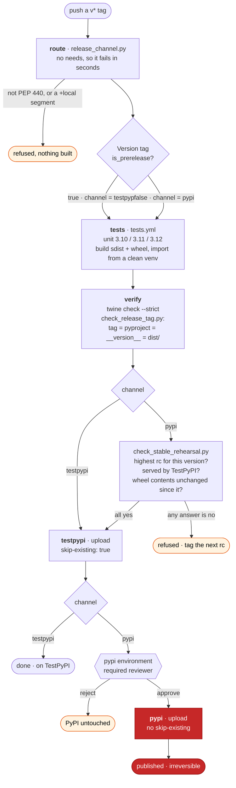
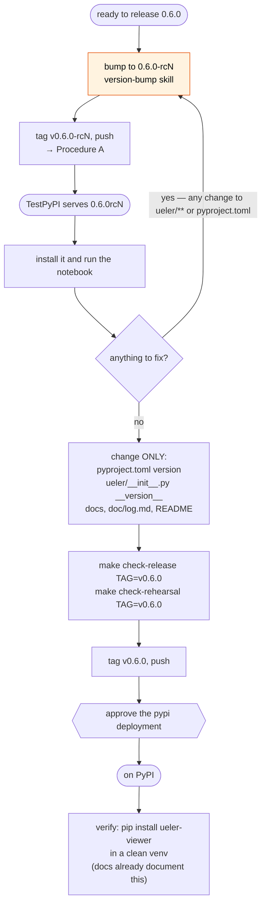

# Release procedure

How to publish UELer. This is the runbook — what to type, in what order, and what each refusal means. The reasoning behind the design is in [`issue_tracking/issue79_release_channel_routing.md`](issue_tracking/issue79_release_channel_routing.md), and the packaging decisions are in [`../docs/develop-notes/packaging.md`](../docs/develop-notes/packaging.md).

Two facts shape everything below:

* **Install name `ueler-viewer`, import name `ueler`.** `pip install ueler-viewer`, then `import ueler`. The distribution name is `[project] name` in `pyproject.toml`; the import name is the `ueler/` directory. See [`issue_tracking/issue79_dist_name_rename.md`](issue_tracking/issue79_dist_name_rename.md).
* **PyPI is append-only.** A version can be yanked but never replaced or reused. Everything here exists to make that survivable.

---

## The routing rule

The tag decides the index. Nothing else does.

| What you push | Where it goes | Attended? |
| --- | --- | --- |
| `v0.6.0-alpha1`, `v0.6.0-beta2`, `v0.6.0-rc1` — any pre-release | TestPyPI | no, unattended |
| `v0.6.0` — a stable version | TestPyPI, then PyPI | yes, the `pypi` environment's reviewer must approve |

`tools/release_channel.py` computes this from `packaging.version.Version(tag).is_prerelease`, so tag spelling is normalised, not matched textually: `-alpha2` → `0.5.0a2`, `-rc1` / `.rc1` / `rc1` → `0.5.0rc1`. A `.postN` of a stable version is *not* a pre-release and goes to PyPI.



Every publishing path passes through TestPyPI: `pypi` declares `needs: testpypi`, so the cheapest pre-flight always runs before the irreversible upload. `workflow_dispatch` enters the same graph and cannot skip any of it.

---

## One-time setup

Not done yet as of 2026-08-19. **Both of these are preconditions of the first stable tag** — do not push one until they exist.

1. **PyPI Trusted Publisher (pending).** PyPI → *Account settings* → *Publishing* → owner `HartmannLab`, repository `UELer`, workflow `release.yml`, environment `pypi`. It must be a *pending* publisher because `ueler-viewer` does not exist on PyPI yet (`https://pypi.org/simple/ueler-viewer/` returns 404). Without it the upload fails; a pending publisher does **not** reserve the name — the first upload creates it.
2. **Required reviewer on the `pypi` environment.** GitHub → *Settings* → *Environments* → `pypi` → *Required reviewers*. This is what keeps a human between a stable tag and an irreversible upload.

Already done: the TestPyPI publisher (environment `testpypi`) — `ueler-viewer 0.5.0a2` published from the `v0.5.0-alpha2` tag push, which also claimed the name there.

Optional: a **tag ruleset** (*Settings* → *Rules* → *Rulesets*, target *Tags*, pattern `v*`) restricting who may create release tags.

---

## Procedure A — ship a pre-release

Use for `alpha` and `beta` previews. Unattended; nothing irreversible happens on PyPI.

1. **Choose the version.** Use the `version-bump` skill; it decides MAJOR/MINOR/PATCH and the pre-release suffix, and syncs `pyproject.toml`, `ueler/__init__.py`, `doc/log.md` and `README.md`. The bump itself is the developer's decision.
2. **Check locally before tagging:**
   ```bash
   make test-ci                          # the suite, no skips tolerated
   make build && make check-dist         # sdist + wheel, twine check --strict
   make check-release TAG=v0.6.0-alpha1  # tag == pyproject == __version__ == dist/
   ```
3. **Merge to the branch you tag from** (`main`, historically).
4. **Tag and push:**
   ```bash
   git tag v0.6.0-alpha1
   git push origin v0.6.0-alpha1
   ```
   Lightweight tags, matching every existing tag.
5. **Watch the run.** Actions → *Release*. Job order: `route` → `tests` → `verify` → `testpypi`. The run summary states the routing decision before anything uploads.
6. **Confirm it landed:**
   ```bash
   curl -s https://test.pypi.org/pypi/ueler-viewer/json | python -c "import sys,json; print(sorted(json.load(sys.stdin)['releases']))"
   ```

---

## Procedure B — ship a stable release

**Two tags, always.** A stable version may only be the promotion of a release candidate that TestPyPI already serves, so `v0.6.0` cannot be the first tag of the `0.6.0` line.



The loop back to a new `rc` is the whole point: after the final candidate, nothing that ships may change. There is no path from a post-rc fix straight to a stable tag.

### B1 — publish the candidate

Run Procedure A with an `rc` version: `v0.6.0-rc1`. Confirm it appears on TestPyPI, and ideally install it and run the notebook:

```bash
pip install --pre --index-url https://test.pypi.org/simple/ --extra-index-url https://pypi.org/simple/ ueler-viewer==0.6.0rc1
```

An `alpha` does **not** count as a candidate. Only `rc` does.

### B2 — promote it

From the candidate's commit, change **only** the version declarations and documentation:

* `pyproject.toml` → `version = "0.6.0"`
* `ueler/__init__.py` → `__version__ = "0.6.0"`
* `doc/log.md`, `README.md`, `docs/**` — free to change

Nothing else under `ueler/` and nothing else in `pyproject.toml` may move. The `version-bump` skill's rc → stable bump touches exactly the allowed set.

Then dry-run the gate locally before tagging:

```bash
make check-release TAG=v0.6.0
make check-rehearsal TAG=v0.6.0     # asks TestPyPI whether v0.6.0-rc1 is really there
```

Then tag and push as in Procedure A. The run adds two things: the rehearsal check inside `verify`, and the `pypi` job waiting on approval after `testpypi` succeeds.

### B3 — approve

Actions → the run → *Review deployments* → approve `pypi`. A run can wait up to 30 days. Approving is the irreversible step: read what `verify` printed first.

### B4 — after publishing

```bash
pip install ueler-viewer==0.6.0     # from a clean venv, from outside the repo
```

The documentation flip is **already done**: `README.md` and `docs/installation.md` lead with the plain `pip install ueler-viewer` from PyPI and keep the long TestPyPI command in a *Pre-releases* subsection. Nothing needs rewriting per release — only check that any version number quoted on those pages still makes sense, and note that until the first stable upload exists, the PyPI command they document has nothing to resolve.

---

## If a fix is needed after the candidate

Tag the next candidate. There is no shortcut: any change to `ueler/**` or `pyproject.toml` after `rc1` means `rc2`, published to TestPyPI, and the promotion is measured against `rc2`. Expect `rc2`, `rc3` — that is the mechanism working.

---

## What the guards check, and what a refusal means

| Refusal | What happened | What to do |
| --- | --- | --- |
| `tag 'x' is not a valid PEP 440 version` | typo in the tag | delete the tag, retag |
| `tag carries the local version segment '+…'` | tagged a dirty version | retag without it |
| `a push to a branch reached the release workflow` | the workflow ran on a non-tag ref | nothing; it only publishes from tags |
| `FAIL: these do not describe the same release` | tag, `pyproject.toml`, `__version__` and `dist/` disagree | `version-bump` skill to sync, `make build` to refresh `dist/` |
| `no release candidate found for X` | no `rc` tag for that version, or only alphas | Procedure B1 |
| `X is tagged but TestPyPI does not serve it` | the candidate's run failed before its upload | fix and re-run that run; do not promote until the rc is on the index |
| `these files ship in the wheel and changed` | code or metadata moved after the candidate | tag the next `rc` |
| `changed beyond its version line` | a version-bearing file changed more than its version | either revert the extra change or tag the next `rc` |
| `the added version is X, expected Y` | the bump went to the wrong number | fix the declaration |

`route` runs with no `needs`, so the first four fail in seconds rather than after the full test matrix.

---

## Recovery

* **Wrong pre-release tag pushed.** It publishes to TestPyPI and nothing else. Move to the next pre-release number; that TestPyPI version is spent, which costs nothing.
* **Wrong stable tag pushed.** *Reject* the pending `pypi` deployment — PyPI is untouched. The `testpypi` job will already have uploaded that version, but `skip-existing: true` means a later re-run of the same version passes without re-uploading, so it does not block a corrected release.
* **Deleting a tag does not trigger anything.** Only a tag *push* starts the workflow, and re-pushing the same tag name starts a fresh run.
* **A bad version reached PyPI.** Yank it on PyPI and release a new version. It can never be replaced or reused. This is the case the whole procedure exists to prevent.

---

## Local escape hatch

When Actions is unavailable, `make publish-test` and `make publish` upload `dist/*` with twine directly. Both depend on `check-dist`, not on `build`, so they send exactly the artifacts that were built and inspected. **They bypass the rehearsal gate**, so `make publish` should only ever be used after `make check-rehearsal TAG=…` passes.

---

## Files involved

| File | Role |
| --- | --- |
| `.github/workflows/release.yml` | the pipeline: `route` → `tests` → `verify` → `testpypi` → `pypi` |
| `.github/workflows/tests.yml` | called by the above; its `package` job builds the artifacts that get published |
| `tools/release_channel.py` | which index this tag goes to |
| `tools/check_release_tag.py` | tag == `pyproject.toml` == `ueler.__version__` == `dist/` filenames |
| `tools/check_stable_rehearsal.py` | a stable tag must promote a published `rc` |
| `tests/test_release_channel.py`, `tests/test_stable_rehearsal.py` | tests for the two above |
| `Makefile` | `test-ci`, `build`, `check-dist`, `check-release`, `check-rehearsal`, `publish-test`, `publish` |
