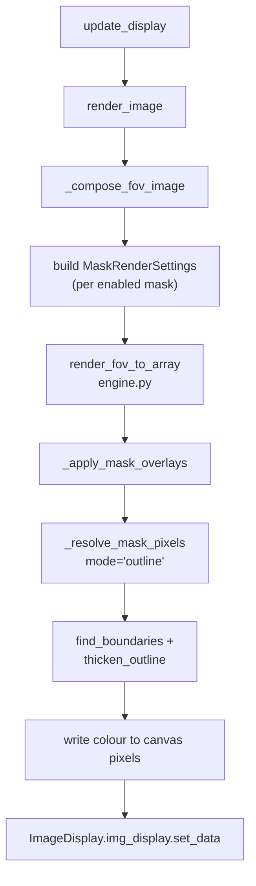
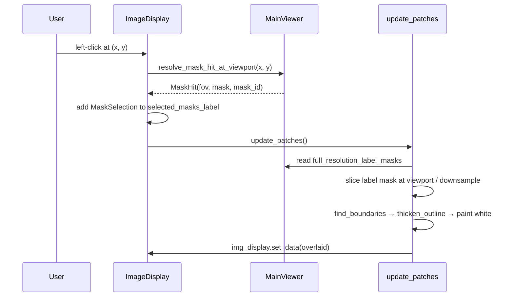
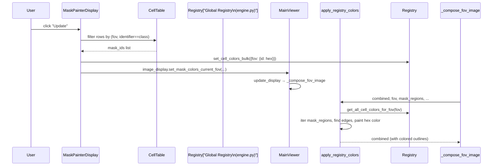
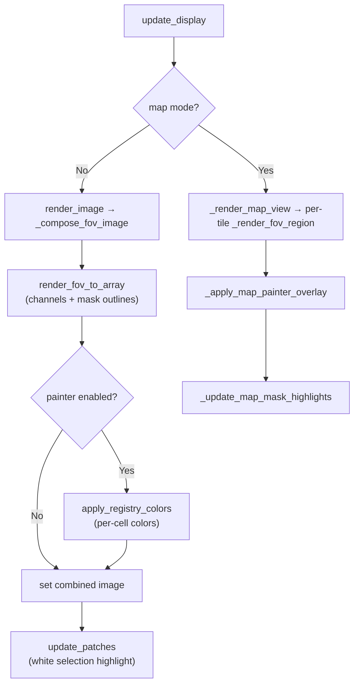

# Mask Rendering, Highlighting, and Coloring

## Overview

UELer supports three distinct but interrelated visual layers on top of cell mask data:

| Layer | Who controls it | How it appears |
|---|---|---|
| **Rendering** | Main viewer controls (Masks panel) | Solid-colour outlines via a per-mask colour dropdown |
| **Highlighting** | `ImageDisplay` clicks / plugin callbacks | White outline on the clicked or scatter-selected cell |
| **Coloring** | `MaskPainterDisplay` plugin | Per-class coloured outlines driven by a global cell-color registry |

All three layers are composited in `update_display` and are aware of both single-FOV mode and stitched-map mode.

---

## Relevant Files

| File | Role |
|---|---|
| `ueler/viewer/main_viewer.py` | `ImageMaskViewer` — owns `update_display`, `_compose_fov_image`, `_update_map_mask_highlights`, `_apply_map_painter_overlay` |
| `ueler/viewer/image_display.py` | `ImageDisplay` — owns `update_patches` (single-FOV selection highlight) |
| `ueler/viewer/mask_color_overlay.py` | Stateless helpers: `apply_registry_colors`, `collect_mask_regions`, `derive_downsampled_region` |
| `ueler/rendering/engine.py` | Low-level rendering: `render_fov_to_array`, `MaskRenderSettings`, `_resolve_mask_pixels`, `scale_outline_thickness`, `thicken_outline` |
| `ueler/rendering/__init__.py` | Re-exports engine symbols + global registry functions (`set_cell_color`, `set_cell_colors_bulk`, `get_all_cell_colors_for_fov`, `clear_cell_colors`) |
| `ueler/viewer/plugin/mask_painter.py` | `MaskPainterDisplay` — UI to assign class-based colors and push them to the registry |

---

## 1. Mask Rendering (Main Control)

### Concept

Each mask overlay is an integer label array (one integer per pixel, 0 = background). The main control renders all enabled masks as **outlines** in a user-selected colour using a uniform colour per mask name.

### Widget Controls (Masks accordion panel)

| Widget | Type | Purpose |
|---|---|---|
| `mask_display_controls[mask_name]` | `Checkbox` | Show/hide the named mask overlay |
| `mask_color_controls[mask_name]` | `Dropdown` | Solid colour (from `PREDEFINED_COLORS`) for this mask |
| `mask_outline_thickness_slider` | `IntSlider` | Global outline thickness (px at native resolution) |

All three widgets call `update_display(current_downsample_factor)` on change.

### Rendering Pipeline



Key steps inside `_compose_fov_image` (main_viewer.py ~L3740):

1. Collect enabled masks from `mask_display_controls`.
2. For each enabled mask, call `_get_label_mask_at_factor(fov_name, mask_name, downsample_factor)` to retrieve (or compute) the downsampled label array.
3. Look up the chosen colour from `mask_color_controls` → map through `PREDEFINED_COLORS` → `to_rgb()`.
4. Build a `MaskRenderSettings(array=mask_array, color=color_rgb, mode="outline", outline_thickness=..., downsample_factor=...)`.
5. Pass all mask settings to `render_fov_to_array` which calls `_apply_mask_overlays`.

### MaskRenderSettings dataclass

```python
@dataclass(frozen=True)
class MaskRenderSettings:
    array: np.ndarray       # downsampled label array for the visible region
    color: ColorTuple       # (R, G, B) floats 0–1
    alpha: float = 1.0
    mode: str = "fill"      # "outline" (cell borders) or "fill" (solid fill)
    outline_thickness: int = 1
    downsample_factor: int = 1
```

`_resolve_mask_pixels` uses `skimage.segmentation.find_boundaries` (mode="inner") to obtain border pixels, then `thicken_outline` to apply the dilation requested by `outline_thickness`.

### Outline thickness scaling

`scale_outline_thickness(thickness, downsample_factor)` in `engine.py` proportionally reduces the pixel-space dilation so that the apparent border width on screen is constant regardless of zoom level.

### Map mode

In map mode, `_render_map_view` delegates per-tile rendering to `VirtualMapLayer.render`. Each tile calls `_render_fov_region` → `_compose_fov_image`, so mask overlays work identically per tile.

---

## 2. Selection Highlighting (by Plugins / Click)

### Concept

When the user clicks on a cell or a plugin (chart, heatmap) selects one, a **white outline** is drawn on top of the current composited image without a full re-render. This is stored in `ImageDisplay.selected_masks_label` as a set of `MaskSelection` namedtuples.

### MaskSelection dataclass

```python
@dataclass(frozen=True)
class MaskSelection:
    fov: str
    mask: str
    mask_id: int
```

### Single-FOV highlight flow



`update_patches` in `image_display.py` (~L300):

- Reads `self.main_viewer.full_resolution_label_masks` (populated by `update_display`).
- Slices the label array to the current viewport using `[ymin:ymax:downsample_factor, xmin:xmax:downsample_factor]`.
- Renders matching IDs as white edges onto a copy of `self.combined`.
- Supports multi-select (Ctrl+click) and right-click clear.

### Map mode highlight flow

In map mode, `update_patches` delegates to `_update_map_mask_highlights` (main_viewer.py ~L1464):

- Reads `layer.last_tile_viewports()` to know where each tile was placed.
- For each `MaskSelection`, reads the full-resolution mask from `_get_mask_array`, slices to the tile's rendered region, downsamples, extracts edges, and paints white at the tile's canvas destination coordinates.

### Plugin-triggered highlights

The chart and heatmap plugins call `highlight_cells()` on the viewer, which updates `selected_masks_label` and calls `update_patches()`. In the grid-view variant, `GridChannelDisplay.update_mask_highlights` mirrors the same logic across all channel panes.

---

## 3. Mask Coloring (MaskPainterDisplay Plugin)

### Concept

The mask painter assigns a **custom hex color to every individual cell** across all FOVs, keyed by a chosen identifier column (e.g. `cell_type`, `cluster`). Colors are stored in a **global in-process registry** inside `ueler/rendering/engine.py` and read back during rendering. This is separate from the uniform-colour-per-mask rendering in Section 1.

### Global Color Registry

```python
# ueler/rendering/engine.py (module-level)
_cell_colors: dict[str, dict[int, str]] = {}  # fov_name → {mask_id: hex_color}

set_cell_color(fov, mask_id, color)       # single write
set_cell_colors_bulk(entries)             # bulk write {fov: {mask_id: color}}
get_cell_color(fov, mask_id)              # single read
get_all_cell_colors_for_fov(fov)          # returns full dict for one FOV
clear_cell_colors()                       # wipe all entries
```

### MaskPainterDisplay widget structure

`MaskPainterDisplay` (plugin/mask_painter.py) extends `PluginBase`.

| Widget | Type | Purpose |
|---|---|---|
| `identifier_dropdown` | `Dropdown` | Column from `cell_table` to group cells by |
| `class_color_controls[cls]` | `ColorPicker` (per class) | Hex color for that class |
| `default_color_picker` | `ColorPicker` | Fallback color for hidden/unselected classes |
| `sorting_items_tagsinput` | `TagsInput` | Ordered selection of visible classes |
| `show_all_checkbox` | `Checkbox` | Show all classes vs. selected only |
| `enabled_checkbox` | `Checkbox` | Enable/disable overlay rendering |
| `update_button` | `Button` | Trigger `apply_colors_to_masks` |
| Save / Load / Manage tabs | `Tab` | Palette persistence (`.maskcolors.json`) |

### Color application flow



The key function is `apply_registry_colors` in `mask_color_overlay.py`:

1. Receives the partially rendered `combined` float32 image.
2. Looks up per-cell colors from the global registry (or an explicit `color_map`).
3. Iterates each mask region, extracts inner boundaries via `skimage.segmentation.find_boundaries`, dilates by `_resolve_outline_dilation`, and writes the hex color at boundary pixels.
4. Cells in `exclude_ids` (currently selected/highlighted cells) are skipped so selection highlights remain visible on top.

### Hidden vs. visible classes

Classes not in `sorting_items_tagsinput.value` are "hidden" — the painter assigns them `default_color` (typically transparent / background-like grey) in both the registry and the current-FOV display. Their per-class colors are cached in `hidden_color_cache` so they can be restored when re-selected.

### Palette persistence

Color sets are saved as `.maskcolors.json` files and indexed in `mask_color_sets_index.json` (both under `.UELer/` by default). `serialize_class_color_controls` collects the current picker values; `apply_color_map_to_controls` restores them on load.

### Map mode painter overlay

In map mode, `_apply_map_painter_overlay` (main_viewer.py ~L1591) is called **before** `_update_map_mask_highlights`:

- Reads `get_all_cell_colors_for_fov(fov)` for every tile visible in the last render.
- Groups mask IDs by colour for efficient edge computation.
- Paints coloured outlines per colour group directly onto the stitched canvas.
- Updates `display.combined` so the subsequent highlight step builds on the painted image.

---

## Call order in `update_display`



Order matters:
1. `render_fov_to_array` — channels + uniform mask outlines
2. `apply_registry_colors` — class-based colored outlines from painter registry
3. `update_patches` / `_update_map_mask_highlights` — white selection highlights on top

---

## State Management

| State | Location | Notes |
|---|---|---|
| Enabled masks | `ui_component.mask_display_controls[name].value` | Checkbox per mask name |
| Mask outline thickness | `main_viewer.mask_outline_thickness` | Synced from slider |
| Uniform mask color | `ui_component.mask_color_controls[name].value` | One per mask name |
| Selected cells | `image_display.selected_masks_label` | `set[MaskSelection]` |
| Painter class colors | `engine._cell_colors` | Global dict, keyed `{fov: {mask_id: hex}}` |
| Painter UI state | `MaskPainterDisplay.class_color_controls` | `{cls_str: ColorPicker}` |
| Hidden color cache | `MaskPainterDisplay.hidden_color_cache` | Preserves colors while class is deselected |
| Active color set name | `MaskPainterDisplay.active_color_set_name` | Last saved/loaded palette |

---

## How to Extend or Customize

### Add a new mask render mode

1. Add a new `mode` string (e.g. `"dashed"`) to `_resolve_mask_pixels` in `engine.py`.
2. Implement the pixel-selection logic there (returns a bool array).
3. The `MaskRenderSettings.mode` field propagates through the rest of the pipeline unchanged.

### Drive colors from an external source

Use the registry API directly:

```python
from ueler.rendering import set_cell_colors_bulk

# {fov_name: {mask_id: "#RRGGBB"}}
set_cell_colors_bulk({"FOV1": {101: "#FF0000", 202: "#00FF00"}})
# The next update_display call will pick these up automatically.
```

### Suppress selection highlights for programmatic rendering

Set `image_display.selected_masks_label = set()` before calling `update_display`, or pass `exclude_ids` to `apply_registry_colors`.

---

## Limitations / Open Questions

- The global registry (`engine._cell_colors`) is a plain module-level dict — it is not persisted across sessions and will be lost on kernel restart. Color sets must be re-applied via the painter plugin.
- `apply_registry_colors` iterates `np.unique(region_array)` per mask region, which may be slow when many distinct IDs are present in the visible window.
- The selection highlight always uses white (`[1.0, 1.0, 1.0]`) — there is currently no UI to change the highlight colour.
- In map mode, `_apply_map_painter_overlay` bypasses the per-tile render cache and re-paints on every `update_display` call.
