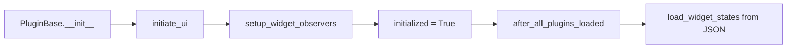
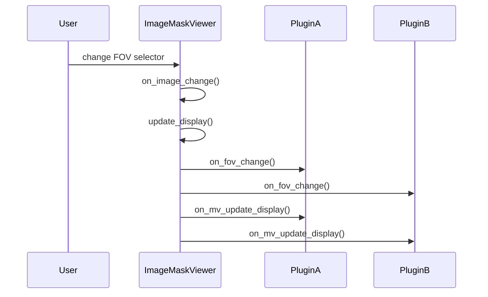
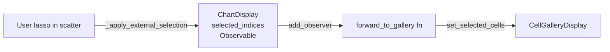
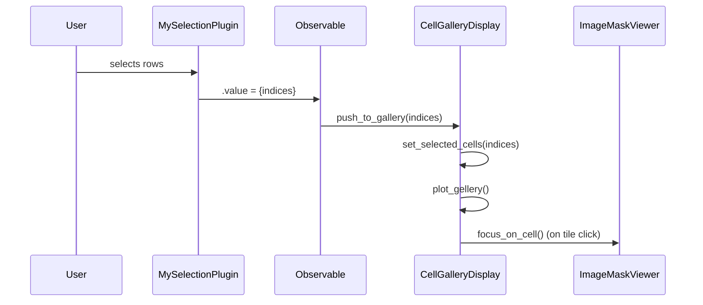
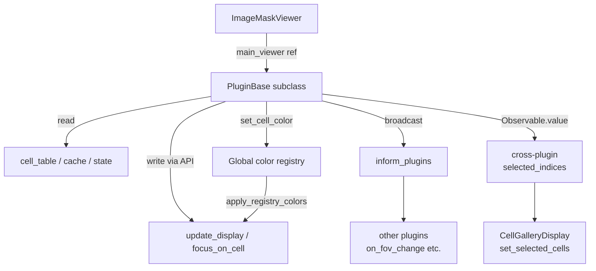
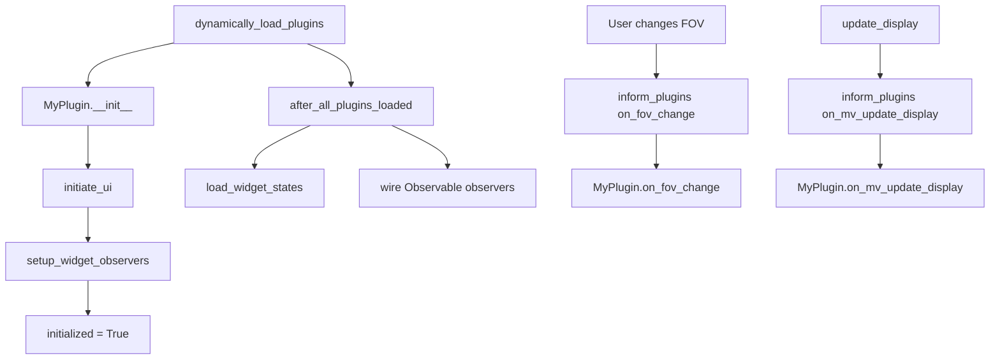

# Plugin Development Guide

## Overview

UELer plugins are Python classes that extend `PluginBase` and live inside
`ueler/viewer/plugin/`.  The main viewer discovers them automatically via
`dynamically_load_plugins()`, instantiates each one, and registers it in
`self.SidePlots` under a key built from the module filename
(`<module>_output`).  Each plugin receives a reference to the live
`ImageMaskViewer` instance at construction time, giving it full access to
all viewer state, caches, and public APIs.

Plugins receive structured lifecycle hooks whenever the viewer changes its
FOV, cell table, overlay, or map mode.  They can also communicate with other
plugins directly through the `SidePlots` namespace, or loosely through the
`Observable` pub-sub helper.

---

## Relevant Files

| File | Role |
|---|---|
| `ueler/viewer/plugin/plugin_base.py` | `PluginBase` — base class every plugin must inherit |
| `ueler/viewer/observable.py` | `Observable` — lightweight pub-sub for cross-plugin signals |
| `ueler/viewer/main_viewer.py` | `ImageMaskViewer` — viewer host; owns `inform_plugins`, `dynamically_load_plugins`, `SidePlots` |
| `ueler/viewer/plugin/cell_gallery.py` | Example: `CellGalleryDisplay` — receives FOV changes and cell selections |
| `ueler/viewer/plugin/chart.py` | Example: `ChartDisplay` — pushes cell selections via `Observable` |
| `ueler/viewer/plugin/mask_painter.py` | Example: `MaskPainterDisplay` — hooks `on_mv_update_display` and `on_cell_table_change` |
| `ueler/viewer/plugin/heatmap.py` | Example: `HeatmapDisplay` — multi-layer plugin with adapter pattern |

---

## Plugin Template

Create a new file `ueler/viewer/plugin/my_plugin.py`:

```python
from __future__ import annotations

from ipywidgets import Button, HBox, Output, VBox
from ueler.viewer.plugin.plugin_base import PluginBase


class MyPlugin(PluginBase):
    """Minimal plugin skeleton."""

    def __init__(self, main_viewer, width, height):
        super().__init__(main_viewer, width, height)
        # SidePlots_id: key suffix used to store this plugin in SidePlots.
        # Must be unique and match <module_name>_output.
        self.SidePlots_id = "my_plugin_output"
        # displayed_name: label shown in the UI accordion tab.
        self.displayed_name = "My Plugin"
        self.main_viewer = main_viewer

        # Build your widgets here.
        self.plot_output = Output()
        self.refresh_button = Button(description="Refresh")
        self.refresh_button.on_click(self._on_refresh)

        self.initiate_ui()
        self.setup_widget_observers()   # auto-persists widget values to JSON
        self.initialized = True

    # ------------------------------------------------------------------
    # Required: build the top-level widget exposed to the UI.
    # ------------------------------------------------------------------
    def initiate_ui(self):
        self.ui = VBox([
            HBox([self.refresh_button]),
            self.plot_output,
        ])

    # ------------------------------------------------------------------
    # Optional: wide-panel / footer layout support.
    # Return None to keep the plugin in the SidePlots accordion only.
    # ------------------------------------------------------------------
    def wide_panel_layout(self):
        return None   # or {"control": ..., "content": ...}

    # ------------------------------------------------------------------
    # Viewer lifecycle hooks (all optional, all no-ops in PluginBase).
    # ------------------------------------------------------------------
    def on_fov_change(self):
        """Called after the active FOV changes."""
        self._refresh()

    def on_cell_table_change(self):
        """Called after the cell table is replaced or modified."""
        self._refresh()

    def on_mv_update_display(self):
        """Called after every composite image render."""
        pass

    def on_map_mode_activate(self):
        """Called when stitched-map mode is turned on."""
        pass

    def on_map_mode_deactivate(self):
        """Called when stitched-map mode is turned off."""
        pass

    # ------------------------------------------------------------------
    # Internal helpers.
    # ------------------------------------------------------------------
    def _on_refresh(self, _btn=None):
        self._refresh()

    def _refresh(self):
        with self.plot_output:
            self.plot_output.clear_output(wait=True)
            print(f"Active FOV: {self.main_viewer.ui_component.image_selector.value}")
```

### Registration

The viewer auto-discovers any `PluginBase` subclass in a non-underscore `.py`
file in `ueler/viewer/plugin/`.  The plugin is stored in
`viewer.SidePlots.my_plugin_output` (module filename without `.py`, plus
`_output`).

To load only a subset of plugins programmatically:

```python
viewer.dynamically_load_plugins(allow_plugins={"my_plugin", "cell_gallery"})
viewer.after_all_plugins_loaded()
```

---

## Widget Structure and Layout

### Minimum surface

| Attribute | Type | Required | Description |
|---|---|---|---|
| `self.ui` | `ipywidgets.Widget` | Yes | Root widget displayed in the accordion |
| `self.SidePlots_id` | `str` | Yes | Key suffix for `SidePlots` registry |
| `self.displayed_name` | `str` | Yes | Accordion tab label |
| `self.initialized` | `bool` | Yes | Set `True` after `__init__` completes; guards widget observers |

### Optional footer/wide-panel

Implement `wide_panel_layout()` to place part of your plugin in the
horizontal footer area below the image canvas:

```python
def wide_panel_layout(self):
    return {
        "control": self.my_control_column,   # left control column
        "content": self.my_main_content,     # main wide content area
    }

def wide_panel_cache_token(self):
    # Return a hashable token; footer is rebuilt only when it changes.
    return (self.some_state_flag,)
```

### Widget state persistence

Call `self.setup_widget_observers()` in `__init__` **after** creating all
widgets.  This attaches `.observe(..., names='value')` to every widget in
`self.ui_component` and saves state to
`.UELer/<displayed_name>_widget_states.json` on every change.
States are restored by `after_all_plugins_loaded()`.



---

## Viewer API — Communicating with the Viewer

Access the viewer through `self.main_viewer`.  The table below lists the most
useful attributes and methods.

### Key viewer attributes

| Attribute | Type | Description |
|---|---|---|
| `main_viewer.cell_table` | `pd.DataFrame` | Full cell table (read-only) |
| `main_viewer.fov_key` | `str` | Column name for FOV identifier |
| `main_viewer.x_key` | `str` | Column name for X coordinate |
| `main_viewer.y_key` | `str` | Column name for Y coordinate |
| `main_viewer.label_key` | `str` | Column name for mask label |
| `main_viewer.mask_key` | `str` | Column name linking cells to masks |
| `main_viewer.current_downsample_factor` | `int` | Active downsample level |
| `main_viewer.masks_available` | `bool` | Whether mask data is present |
| `main_viewer.annotations_available` | `bool` | Whether pixel annotation data is present |
| `main_viewer.pixel_size_nm` | `float` | Physical pixel size in nm |
| `main_viewer._map_mode_active` | `bool` | True when stitched map mode is on |
| `main_viewer.SidePlots` | `SimpleNamespace` | Registry of all loaded plugins |
| `main_viewer.image_display` | `ImageDisplay` | Matplotlib canvas widget |

### Key viewer methods

| Method | Description |
|---|---|
| `main_viewer.update_display(factor)` | Re-render the composited image |
| `main_viewer.focus_on_cell(fov, x, y, radius=100)` | Pan and zoom the canvas to a single cell |
| `main_viewer.capture_overlay_snapshot()` | Snapshot the active overlay config for export |
| `main_viewer.get_active_fov()` | Returns active FOV name, or `None` in map mode |
| `main_viewer.capture_viewport_bounds()` | Returns current axis limits as a dict |
| `main_viewer.get_pixel_size_nm()` | Returns the physical pixel size (map-aware) |
| `main_viewer.inform_plugins(method_name)` | Broadcast a lifecycle event to all plugins |
| `main_viewer.apply_mask_visibility_state(state)` | Set mask visibility from a `{name: bool}` dict |
| `main_viewer.on_plugin_mask_outline_change(thickness)` | Update the global mask outline slider from a plugin |

### Accessing the cell table

```python
df = self.main_viewer.cell_table
fov_col = self.main_viewer.fov_key
current_fov = self.main_viewer.ui_component.image_selector.value

# Rows for the current FOV
fov_rows = df[df[fov_col] == current_fov]
```

### Triggering a display refresh

Call `update_display` after changing any state that should be reflected on
the canvas:

```python
self.main_viewer.update_display(self.main_viewer.current_downsample_factor)
```

### Navigating to a cell

```python
self.main_viewer.focus_on_cell(fov_name, x_px, y_px, radius=75)
```

This respects stitched-map mode automatically: if the cell belongs to a tile
that is part of the active map, the canvas scrolls to the map-space position.

---

## `inform_plugins` — Lifecycle Events

`ImageMaskViewer.inform_plugins(method_name)` iterates every plugin in
`SidePlots` and calls `plugin.<method_name>()` if the attribute exists.

```python
# ueler/viewer/main_viewer.py
def inform_plugins(self, method_name):
    for attr_name in dir(self.SidePlots):
        attr = getattr(self.SidePlots, attr_name)
        if isinstance(attr, PluginBase) and hasattr(attr, method_name):
            getattr(attr, method_name)()
```

Events currently broadcast by the viewer:

| Event | When fired |
|---|---|
| `on_fov_change` | FOV selector changes; map mode toggle (after activation/deactivation) |
| `on_cell_table_change` | Cell table is replaced (e.g. after FlowSOM run) |
| `on_mv_update_display` | End of every `update_display()` call |
| `on_map_mode_activate` | Map mode enabled or active map swapped |
| `on_map_mode_deactivate` | Map mode disabled |



---

## Cross-Plugin Communication

### Pattern 1 — Direct access via `SidePlots`

Plugins can reach each other through `self.main_viewer.SidePlots`:

```python
gallery = getattr(self.main_viewer.SidePlots, "cell_gallery_output", None)
if gallery is not None:
    gallery.set_selected_cells(my_indices)
```

Use `getattr(..., None)` defensively: the target plugin may not be loaded.

### Pattern 2 — `Observable` pub-sub

`Observable` (`ueler/viewer/observable.py`) provides a lightweight
value-change notification channel.  The `ChartDisplay` plugin uses it to
push cell selections to `CellGalleryDisplay`:

```python
# In ChartDisplay.__init__
from ueler.viewer.observable import Observable

self.selected_indices: Observable = Observable(set())

# In ChartDisplay.setup_observe() – called once after all plugins are loaded
def setup_observe(self):
    gallery = self.main_viewer.SidePlots.cell_gallery_output

    def forward_to_gallery(indices):
        if self.ui_component.cell_gallery_linked_checkbox.value:
            gallery.set_selected_cells(indices)

    self.selected_indices.add_observer(forward_to_gallery)

# Anywhere in ChartDisplay that updates the selection:
self.selected_indices.value = new_set_of_indices   # fires all observers
```



### Pattern 3 — Named callbacks for targeted events

For events that affect only one specific plugin, the viewer calls the method
directly instead of broadcasting via `inform_plugins`:

```python
# Viewer notifying only the export plugin about pixel-size changes
def _notify_plugins_pixel_size_changed(self, pixel_nm):
    plugin = getattr(self.SidePlots, "export_fovs_output", None)
    if plugin and hasattr(plugin, "on_viewer_pixel_size_change"):
        plugin.on_viewer_pixel_size_change(pixel_nm)
```

Follow the same pattern if your plugin needs to notify a specific other
plugin about a non-standard event.

### Pattern 4 — Shared global registry (mask painter)

`MaskPainterDisplay` writes per-cell colors into the module-level registry in
`ueler/rendering/engine.py` (`set_cell_color`, `set_cell_colors_bulk`,
`clear_cell_colors`).  `CellGalleryDisplay` and the main render pipeline read
from the same registry without direct plugin-to-plugin references:

```python
from ueler.rendering import set_cell_color, get_cell_color, clear_cell_colors

# In MaskPainterDisplay — write
set_cell_color(fov_name, mask_id, "#FF0000")

# In CellGalleryDisplay or render pipeline — read
color = get_cell_color(fov_name, mask_id)
```

Use this pattern only for truly global data (class colors, export configs)
that every rendering path needs.

---

## Linking Two Plugins — Worked Example

### Goal: push scatter-plot selections into the gallery

```python
# my_plugin.py
from __future__ import annotations
from ueler.viewer.observable import Observable
from ueler.viewer.plugin.plugin_base import PluginBase


class MySelectionPlugin(PluginBase):

    def __init__(self, main_viewer, width, height):
        super().__init__(main_viewer, width, height)
        self.SidePlots_id = "my_selection_plugin_output"
        self.displayed_name = "My Selector"
        self.main_viewer = main_viewer

        # Observable that holds the currently selected row indices.
        self.selected_indices: Observable = Observable(set())

        self.initiate_ui()
        self.initialized = True

    def initiate_ui(self):
        from ipywidgets import Output
        self.plot_output = Output()
        self.ui = self.plot_output

    def after_all_plugins_loaded(self):
        """Wire observers once every plugin is guaranteed to be present."""
        gallery = getattr(self.main_viewer.SidePlots, "cell_gallery_output", None)
        if gallery is None:
            return

        def push_to_gallery(indices):
            gallery.set_selected_cells(list(indices))

        self.selected_indices.add_observer(push_to_gallery)

    # Called from your UI logic when the user picks rows:
    def _on_user_selection(self, row_indices: set):
        self.selected_indices.value = row_indices   # triggers push_to_gallery
```



---

## Data Flow Overview



---

## State Management

| Mechanism | Where | Purpose |
|---|---|---|
| `self.main_viewer.<attr>` | Live viewer attributes | Read viewer state (FOV, channels, masks, pixel size …) |
| `self.data.*` | Plugin's own dataclass | Private plugin state (selections, cache, flags) |
| `Observable` | `ueler/viewer/observable.py` | Cross-plugin reactive values |
| Widget state JSON | `.UELer/<displayed_name>_widget_states.json` | Persisted UI values restored by `after_all_plugins_loaded` |
| Global rendering registry | `ueler/rendering/engine.py` | Cell-level color assignments (used by mask painter) |

---

## Lifecycle Diagram



---

## How to Extend or Customize

### Read rendering output

Access the current rendered array via `self.main_viewer.image_display.combined`
(an `(H, W, 3)` float32 NumPy array in `[0, 1]` range).

### Add a footer panel

Return a widget dict from `wide_panel_layout()`.  The viewer calls
`update_wide_plugin_panel` in `ui_components.py` to place the result in the
footer `HBox`.

### Override mask outline behavior

Listen for `on_viewer_mask_outline_change(thickness)` (called directly by the
viewer, not via `inform_plugins`) and call
`self.main_viewer.on_plugin_mask_outline_change(new_thickness)` to push
changes back.

### Add a custom lifecycle event

1. Broadcast it from the viewer: `self.inform_plugins("on_my_event")`.
2. Implement `on_my_event(self)` in the target plugin.

---

## Limitations / Open Questions

- `inform_plugins` calls every matching plugin synchronously in iteration
  order.  Long-running hooks block the notebook kernel during rendering.
- `after_all_plugins_loaded` in `PluginBase` loads widget states from a
  fixed path under `.UELer/`.  Plugins loaded outside
  `dynamically_load_plugins` must call this manually.
- No formal inter-plugin dependency ordering: plugins that need another plugin
  to exist must use `getattr(..., None)` guards.
- The `Observable` pattern has no error handling — an exception in one
  observer silently skips remaining observers.  Add try/except in critical
  forwarding lambdas.
