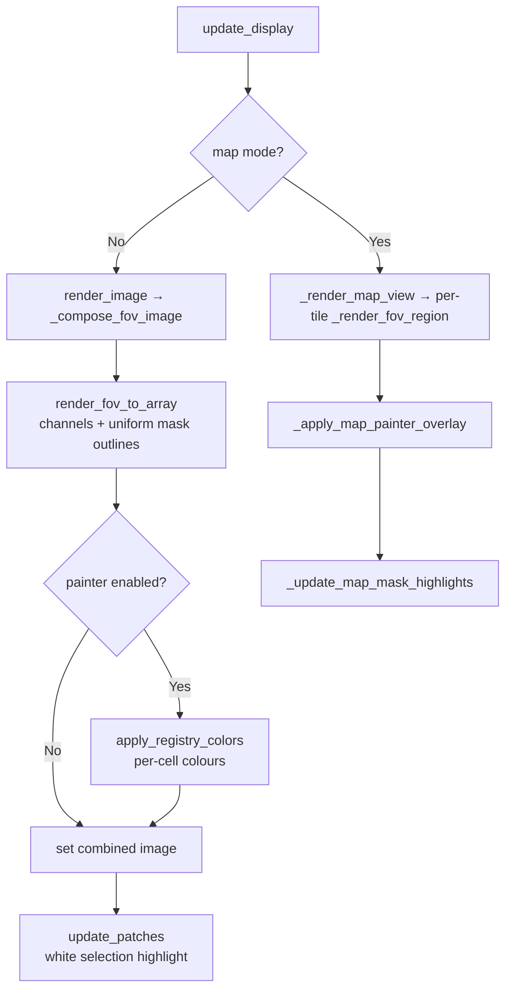

# Mask Rendering, Highlighting & Coloring

> Source: [`dev_note/topic_mask_rendering_highlighting_coloring.md`](https://github.com/HartmannLab/UELer/blob/main/dev_note/topic_mask_rendering_highlighting_coloring.md)

---

## Context

Three different things draw on top of the same segmentation mask, and they are easy to confuse because all three produce coloured cell borders. They have separate owners, separate state, and a fixed compositing order:

| Layer | Owned by | Appears as |
|---|---|---|
| **Rendering** | Left panel, Channels section | One uniform colour per *mask layer*, from a dropdown |
| **Highlighting** | `ImageDisplay` clicks and plugin callbacks | A **white** outline on the selected cells |
| **Coloring** | The **Mask painter** plugin | Per-*cell* colours from a global registry |

All three are composited in `update_display()`, and all three work identically in single-FOV and stitched-map mode.

---

## Compositing order

Order is the thing to get right: each layer draws over the previous one, so selection highlights always win and are never buried under painted colours.



1. `render_fov_to_array` — channels plus uniform mask outlines.
2. `apply_registry_colors` — class-based coloured outlines from the painter registry.
3. `update_patches` / `_update_map_mask_highlights` — white selection highlights on top.

`apply_registry_colors` takes an `exclude_ids` set of the currently selected cells and skips them, which is the other half of keeping the highlight visible.

---

## 1. Uniform mask rendering

A mask overlay is an integer label array — one integer per pixel, 0 for background. The left panel renders each enabled mask as outlines in one user-chosen colour.

Everything funnels into a frozen dataclass in `ueler/rendering/engine.py`:

```python
@dataclass(frozen=True)
class MaskRenderSettings:
    array: np.ndarray       # downsampled label array for the visible region
    color: ColorTuple       # (R, G, B) floats 0–1
    alpha: float = 1.0
    mode: str = "fill"      # "outline" (cell borders) or "fill" (solid)
    outline_thickness: int = 1
    downsample_factor: int = 1
```

`_resolve_mask_pixels` accepts exactly two modes — `"outline"` and `"fill"` — and raises `ValueError` on anything else. Outline mode uses `skimage.segmentation.find_boundaries(..., mode="inner")`, then dilates by `outline_thickness`.

`scale_outline_thickness(thickness, downsample_factor)` reduces the pixel-space dilation in proportion to the downsample factor, so the border's *apparent* width on screen stays constant as you zoom.

!!! note "Map mode reuses the same path"
    `_render_map_view` delegates per-tile rendering to `VirtualMapLayer.render`, and each tile still goes through `_compose_fov_image`. Mask overlays therefore need no map-specific code.

---

## 2. Selection highlighting

A click, a ctrl-click or a plugin selection draws a white outline over the finished composite **without a full re-render**. The state is a set of `MaskSelection(fov, mask, mask_id)` triples on `ImageDisplay.selected_masks_label`.

`update_patches` (`image_display.py`) reads `main_viewer.full_resolution_label_masks`, slices it to the current viewport at the active downsample factor, extracts edges, and paints white onto a copy of `self.combined`. In map mode it delegates to `_update_map_mask_highlights`, which uses `layer.last_tile_viewports()` to find where each tile was placed and paints at the tile's canvas destination.

`GridChannelDisplay._update_grid_patches()` mirrors the same logic across every pane of the [channel grid view](viewer-runtime.md#channel-controls), so locating a cell works there too (#134); `clear_patches()` drops them again.

!!! warning "The highlight colour is not configurable"
    Selection highlights are hard-coded to white (`[1.0, 1.0, 1.0]`). There is no UI for changing it, which matters on a composite that is already bright.

---

## 3. Mask painter coloring

The painter assigns a colour to **every individual cell**, keyed by a chosen cell-table column (`cell_type`, `cluster`, …), and stores them in a module-level registry in `ueler/rendering/engine.py`:

```python
_cell_colors: dict[str, dict[int, str]] = {}   # fov → {mask_id: hex}

set_cell_color(fov, mask_id, color)   # single write
set_cell_colors_bulk(entries)         # bulk write {fov: {mask_id: color}}
get_cell_color(fov, mask_id)          # single read
get_all_cell_colors_for_fov(fov)      # whole dict for one FOV
clear_cell_colors()                   # wipe
```

Using a global registry rather than plugin-to-plugin calls is deliberate: the gallery, the export pipeline and the main render path all read the same colours without holding a reference to the painter. It is the right pattern for genuinely global data and the wrong one for anything else.

### Categorical and continuous coloring

Two modes, with continuous taking precedence when supplied (#115):

- **Categorical** — one colour per class of the identifier column, with a fallback `default_color_picker` for classes that are hidden. Hidden classes' colours are kept in `hidden_color_cache` so they survive being deselected and reselected.
- **Continuous** — `compute_continuous_colors()` maps a numeric column through a matplotlib colormap (`CONTINUOUS_COLORMAPS`), with the range resolved by `resolve_continuous_range()`.

Fill and border are independent (#132): **Fill** and **Border** have their own toggles, colours and opacities, so a cell can be filled with its class colour and bordered in another — or bordered only.

### Palette persistence

Colour sets are saved as `.maskcolors.json` and indexed in `mask_color_sets_index.json`, both under `.UELer/`. `serialize_class_color_controls` captures the current pickers; `apply_color_map_to_controls` restores them.

!!! danger "The registry does not survive a kernel restart"
    `engine._cell_colors` is a plain module-level dict, not persisted state. Saved palettes are what survive — after a restart, reload the colour set through the painter.

---

## Batched outline dilation (#131)

The obvious implementation of per-cell outlines — dilate each cell's edges, then clip the result back to that cell — costs one dilation per cell and dominated render time on a crowded FOV. It has been replaced by two batched passes over the whole region:

- `_max_dilate_labels_4` dilates a *label* image 4-connectedly using `np.maximum` instead of a boolean `|`, so every thickened pixel stays attributed to the cell it grew from. Collisions resolve to the highest mask id — exactly what the old code did, where `pending_edges` was painted in ascending id order and the last write won.
- `_dilate_within_labels` dilates seeds without ever crossing a label boundary. This is equivalent to the old dilate-then-clip, because the shortest path from a pixel to its own cell's boundary never leaves that cell. Restricting propagation *up front* rather than clipping afterwards is what lets a single pass serve every cell: a free dilation would let a neighbouring cell win ground that the clip then discards, erasing borders the per-cell version drew.

Both functions mirror `engine._binary_dilation_4` shift for shift, border handling included, so the batched result is **geometrically identical** to the per-cell version rather than an approximation.

---

## State map

| State | Location |
|---|---|
| Enabled masks | `ui_component.mask_display_controls[name].value` |
| Uniform mask colour | `ui_component.mask_color_controls[name].value` |
| Outline thickness | `main_viewer.mask_outline_thickness` |
| Selected cells | `image_display.selected_masks_label` (`set[MaskSelection]`) |
| Painter cell colours | `engine._cell_colors` (global, `{fov: {mask_id: hex}}`) |
| Painter UI state | `MaskPainterDisplay.class_color_controls` |
| Hidden colour cache | `MaskPainterDisplay.hidden_color_cache` |

---

## Extending

**A new render mode** — add the `mode` string to `_resolve_mask_pixels` in `engine.py` and implement the pixel selection there (return a bool array). `MaskRenderSettings.mode` propagates through the rest of the pipeline unchanged.

**Colours from an external source** — write to the registry directly; the next `update_display` picks them up:

```python
from ueler.rendering import set_cell_colors_bulk

set_cell_colors_bulk({"FOV1": {101: "#FF0000", 202: "#00FF00"}})
```

**Suppress highlights for a programmatic render** — clear `image_display.selected_masks_label`, or pass `exclude_ids` to `apply_registry_colors`.

---

## Known limitations

- The colour registry is not persisted across sessions (see above).
- In map mode, `_apply_map_painter_overlay` bypasses the per-tile render cache and repaints on every `update_display`.
- The selection highlight colour is fixed at white.
