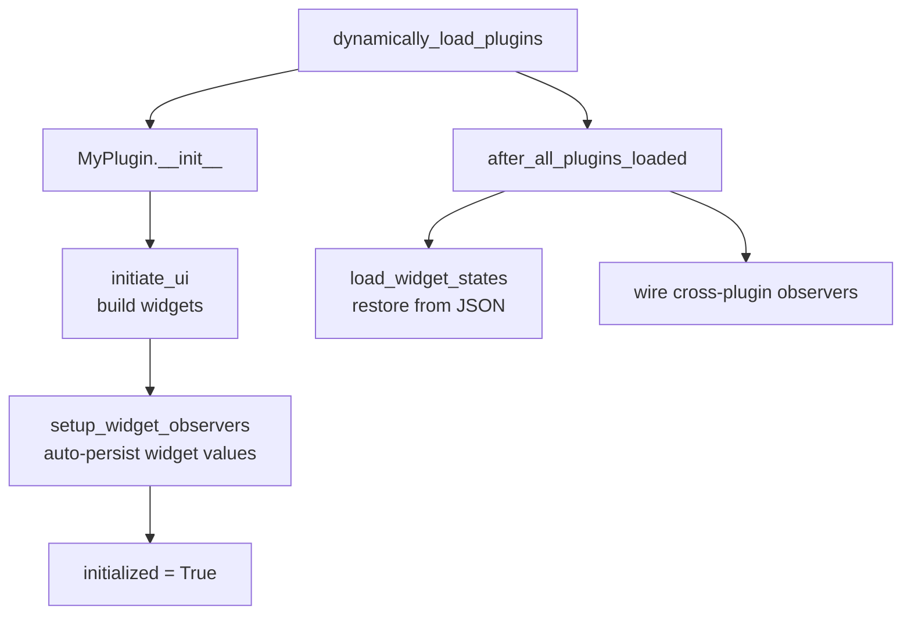

# Plugin Development

> Source: [`dev_note/topic_plugin_development.md`](https://github.com/HartmannLab/UELer/blob/main/dev_note/topic_plugin_development.md) — that note carries the full worked examples and sequence diagrams; this page is the contract.

---

## Context

Every tool in UELer's right panel and footer is a plugin: the ROI manager, batch export, the scatter plot, the mask painter. There is no privileged core set — they all subclass `PluginBase` and are discovered the same way. Adding a feature to UELer usually means writing one of these rather than touching the viewer.

---

## Registration is the filesystem

`ImageMaskViewer.dynamically_load_plugins()` scans `ueler/viewer/plugin/` for `.py` files not prefixed with `_`, imports each, and instantiates every `PluginBase` subclass it finds. **There is no registry to edit** — dropping a module in that directory registers it.

The instance is stored on `viewer.SidePlots` under `<module_name>_output`, so `my_plugin.py` becomes `viewer.SidePlots.my_plugin_output`. That key is how other plugins find yours.

To load a subset — which is how image-only mode works — pass `allow_plugins`:

```python
viewer.dynamically_load_plugins(allow_plugins={"my_plugin", "cell_gallery"})
viewer.after_all_plugins_loaded()
```

`display_ui()` passes `{"roi_manager_plugin", "export_fovs"}` when there is no cell table, which is why the analytical plugins are *absent* rather than disabled in that mode.

---

## The minimum contract

| Attribute | Type | Description |
|---|---|---|
| `self.ui` | `ipywidgets.Widget` | Root widget rendered in the accordion |
| `self.SidePlots_id` | `str` | Registry key suffix; match `<module_name>_output` |
| `self.displayed_name` | `str` | The accordion label — **this is the string the docs and the user call your plugin** |
| `self.initialized` | `bool` | Set `True` at the end of `__init__`; guards the widget observers |

`displayed_name` is load-bearing beyond the label: widget state is persisted to `.UELer/<displayed_name>_widget_states.json`, so renaming a plugin orphans its saved state.

---

## Lifecycle

Construction, then a second pass once every plugin exists:



Wire anything that reaches for *another* plugin in `after_all_plugins_loaded()`, never in `__init__` — during construction the other plugin may not exist yet.

### Broadcast events

`inform_plugins(method_name)` walks `SidePlots` and calls the named method on every plugin that has it. All hooks are no-ops on `PluginBase`, so implement only what you need.

| Hook | When fired |
|---|---|
| `on_fov_change` | FOV selector changes; also after a map-mode toggle |
| `on_cell_table_change` | Cell table replaced or modified (e.g. after a FlowSOM run) |
| `on_mv_update_display` | End of every `update_display()` call |
| `on_selection_change` | Cells selected **in the image** changed — click, ctrl-click, lasso, clear. Fired by `ImageDisplay`, not the viewer |
| `on_map_mode_activate` / `on_map_mode_deactivate` | Map mode enabled/disabled, or the active map swapped |
| `on_no_image_toggle` | Image-layer rendering toggled |

Hooks run **synchronously in iteration order**, so a slow hook blocks the kernel mid-render.

---

## Placement: accordion, footer, or both

By default a plugin lives in the side accordion. Implement `wide_panel_layout()` to also occupy the horizontal footer below the canvas:

```python
def wide_panel_layout(self):
    return {"control": self.my_control_column, "content": self.my_main_content}

def wide_panel_cache_token(self):
    # Hashable; the footer pane is rebuilt only when this changes.
    return (self.some_state_flag,)
```

Returning `None` (the base default) keeps the plugin accordion-only.

**Footer-only plugins (#121).** Set `self.footer_only = True` to leave the accordion *entirely* and render exclusively in the footer. `display_ui()` skips such plugins when assembling the accordion, but they stay on `viewer.SidePlots`, so `collect_wide_plugin_entries()` still places them via `wide_panel_layout()`. The **Scatter plot** and **Heatmap** use this; the **Histogram** deliberately does not. Both footer-only plugins are permanent residents — there is no user-facing toggle for moving a plugin between the two regions.

---

## Talking to the viewer

Everything is reachable through `self.main_viewer`. The full attribute and method tables are in the source note; the ones worth knowing up front:

- `main_viewer.cell_table` — always a real `DataFrame` with a `RangeIndex`, whether the user passed a DataFrame, a CSV path or an AnnData (#123). Plugin code needs no special case.
- `main_viewer.fov_key` / `x_key` / `y_key` / `label_key` / `mask_key` — never hard-code column names; these are user-configurable.
- `main_viewer.update_display(factor)` — re-render the composite.
- `main_viewer.focus_on_cell(fov, x, y, radius=100)` — pan and zoom to one cell; map-mode aware.
- `main_viewer.get_cell_table_adata()` — the table as an AnnData, synced with the UI.

!!! warning "Use the dtype helpers, not `select_dtypes`"
    For class/cluster columns use `ueler.cell_table.categorical_columns(df)`, and for plottable markers `_chart_common.numeric_columns(viewer)`. A plain `select_dtypes(include=['int', 'object'])` misses the `category` dtype that an `.h5ad` round-trip produces — the same class of bug as `np.issubdtype`, which raises on every pandas extension dtype.

---

## Cross-plugin communication

Five patterns, in rough order of how loosely they couple:

1. **Direct access via `SidePlots`** — `getattr(self.main_viewer.SidePlots, "cell_gallery_output", None)`. Always guard with `None`: there is no dependency ordering, and the target may not be loaded.
2. **`Observable` pub-sub** (`ueler/viewer/observable.py`) — a value whose assignment notifies observers. This is how `ChartDisplay` pushes selections to the gallery. Note it has **no error handling**: an exception in one observer skips the rest, so wrap critical forwarding in `try`/`except`.
3. **Named callbacks** — for an event that concerns exactly one other plugin, the viewer calls it directly rather than broadcasting (e.g. `on_viewer_pixel_size_change` to the export plugin).
4. **Shared global registry** — `MaskPainterDisplay` writes per-cell colours into the module-level registry in `ueler/rendering/engine.py` (`set_cell_color`, `set_cell_colors_bulk`, `clear_cell_colors`) that the gallery and every render path read. Reserve this for data that genuinely every rendering path needs.
5. **Following the image's selection (#135)** — the reverse direction. `image_display.selected_masks_label` holds `(fov, mask, mask_id)` triples and `_chart_common.viewer_selection_indices(viewer)` converts them to row indices, matching per FOV so a map-mode selection spanning several FOVs survives.

!!! danger "Never echo a received selection back"
    `set_mask_ids` *replaces* `selected_masks_label` with the current-FOV projection of what it is given, so pushing a highlight for a selection you just received overwrites the user's own selection. That is why the scatter and histogram entry points carry a `push_highlight` flag, and why pattern 5 must be gated on the plugin's **Follow main viewer** checkbox (`_chart_common.build_follow_selection_checkbox()`).

---

## Known limitations

- `inform_plugins` is synchronous and unordered; long hooks block the kernel.
- `PluginBase.after_all_plugins_loaded` loads widget state from a fixed `.UELer/` path, so a plugin instantiated outside `dynamically_load_plugins` must call it itself.
- No formal inter-plugin dependency ordering — hence the `getattr(..., None)` guards.
- `Observable` swallows nothing but stops early: one raising observer skips the remainder.
