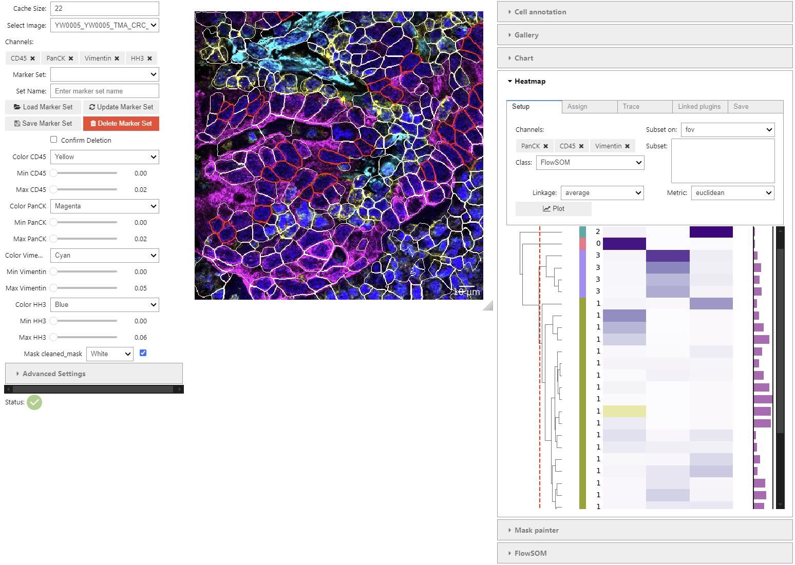

# User Interface

The UELer UI is divided into four main regions.

---

## Layout Overview

| Region | Location | Contents |
|---|---|---|
| **Left panel** | Left column | Channel, Annotation, and Mask accordion controls |
| **Main viewer** | Center | Image display, overlay controls, FOV navigation |
| **Right panel** | Right column | Plugin tools (Mask Painter, ROI Manager, statistics) |
| **Footer** (optional) | Bottom | Wide plugin tabs, e.g., horizontal heatmap or gallery |

Wide plugins toggle the footer automatically when activated.

---

## Left Panel

### Channel Controls

- **Cache Size** — Number of FOVs kept in memory simultaneously.
- **Select Image** — Choose the active FOV.
- **Channel Selection** — Multi-select list of available channels. Hold **Shift** to select a range.
- **Marker Set** — Load a pre-defined combination of channels, colors, and contrast ranges.
- **Channel grid view** — Renders each visible channel as a separate labelled subplot for side-by-side comparison.

### Annotation Controls

Visible when `annotations_folder` contains valid rasters (`<fov>_<annotation>.tif`).

- **Overlay toggle** — Enable/disable the annotation overlay.
- **Display mode** — Choose between mask outlines, annotation fills, or a combined view.
- **Opacity** — Adjust fill transparency.
- **Edit palette** — Customize per-class colors and display labels.

### Mask Controls

Visible when `masks_folder` is configured.

- **Mask overlay** — Enable/disable segmentation mask display.
- **Color set** — Load or save `.maskcolors.json` preset files.
- **Edit palette** — Edit per-class colors for the segmentation mask.

---

## Main Viewer

- **Image canvas** — Displays the composited multi-channel image with any active overlays.
- **Navigation arrows** — Move to the previous or next FOV.
- **Zoom and pan** — Use scroll and drag gestures to navigate the image.
- **Overlay controls** — Toggle masks and annotation overlays without leaving the viewer.
- **Scale bar** — Automatically computed from pixel size metadata when available.

---

## Right Panel (Plugins)

### Mask Painter

Focuses on specific mask classes, lets you reassign colors, and jump between cell identifiers without leaving the plugin.

### ROI Manager

- **Capture** — Save the current viewport as a named ROI.
- **Center** — Jump back to a previously captured ROI.
- **Tag** — Assign custom tags to ROIs using a combo-box that retains entries across sessions.
- **Export** — ROIs are stored in `<base_folder>/.UELer/roi_manager.csv`.

### Statistics / Chart Plugin

When a cell table is loaded, the chart plugin links the scatter plot selection to the image and cell gallery. Cells selected in the chart are highlighted in the viewer and shown in the gallery.

---

## Footer (Wide Plugins)

Some plugins support a **wide layout** that expands into a horizontal footer panel. This keeps the main viewer visible alongside the extended plugin. Enable it via the **Horizontal layout** toggle in the plugin.

Examples:
- **Heatmap** — Cell-by-marker heatmap with FlowSOM clustering.
- **Cell Gallery** — Cropped single-cell thumbnails.
