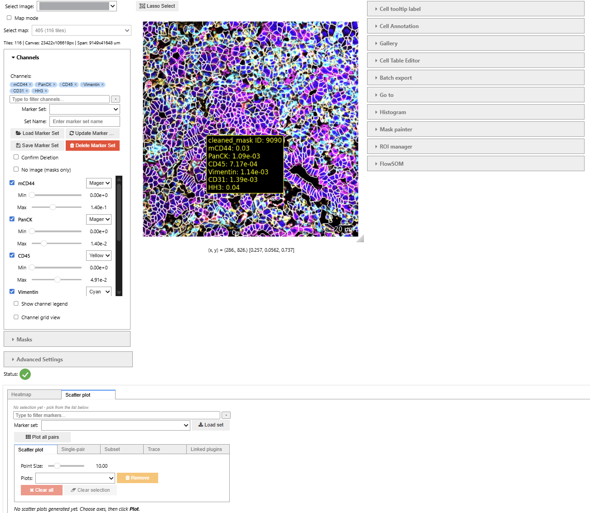

# User Interface

This page is a reference map of the UELer interface — the four main regions and the controls in each.
For a hands-on first run, see [Basic Usage](basic-usage.md).

---

## Layout Overview

The left panel's accordion is **built from your data**: the **Channels** section is always there,
**Masks** appears only if `masks_folder` yielded readable masks, and **Pixel annotations** only if
`annotations_folder` did. A section you cannot find is usually a path that did not load rather than a
setting to switch on.

| Region | Location | Contents |
|---|---|---|
| **Left panel** | Left column | FOV selector, channel / mask / annotation controls, marker sets, advanced settings |
| **Main viewer** | Center | Image canvas, lasso toggle, zoom/pan, scale bar |
| **Right panel** | Right column | Plugin tools (accordion) |
| **Footer** | Bottom | The wide plugins — **Scatter plot** and **Heatmap** |

Plugin placement is fixed, not adaptive: each plugin lives in either the right-panel accordion or the footer, and never moves between them. The **Scatter plot** and **Heatmap** are footer-only because both need the full window width to be readable, so they are absent from the accordion entirely — look for them at the bottom of the viewer, not on the right.

---

## Left Panel

### Top controls

- **Select Image:** — choose the active FOV.
- **Cache Size:** — number of FOVs kept in memory at once (default 100).

### Channels

- **Channels:** — a searchable picker for the visible channels. Click the field to browse the full
  scrollable list, type to filter it (case-insensitive), and use **Select all shown** to take a
  whole filtered group at once or **Clear** to drop everything. Keyboard: ↑/↓ move, Enter toggles,
  Esc closes, Backspace on an empty filter box removes the last selection.
- **Reordering the selection** — each selected channel appears as a chip. Drag a chip by its `⋮⋮`
  grip to move it; a blue bar marks where it will land, and dropping past the last chip sends it to
  the end. You can also click a chip and press ← / → to move it, or Delete to remove it. The order
  is applied to the per-channel controls below and to the order channels are composited in.
- Per-channel **color** dropdown, visibility checkbox, and **Min** / **Max** contrast sliders — one
  row per selected channel, listed in the order of the chips above. Reordering the chips reorders
  these rows and keeps each channel's colour and contrast settings.
- **Show channel legend** — display a color key for the visible channels.
- **Channel grid view** — render each visible channel as its own labelled pane in a synchronized grid.

### Masks

A separate accordion section, present **only when `masks_folder` contained readable masks**:

- **Mask &lt;name&gt;** dropdowns + enable checkboxes — one row per mask layer, each with a single
  uniform colour.
- **Mask outline px:** — outline thickness, applied to every mask layer.

For per-class fill/outline, opacity, continuous colour scales, and saved palettes, use the
**Mask painter** plugin instead.

### Marker Sets

Save and restore named channel/color/contrast combinations: **Marker Set:** dropdown, **Set Name:**
input, and **Load / Save / Update / Delete Marker Set** buttons (deletion is gated by a **Confirm
Deletion** checkbox).

### Pixel annotations

Also its own accordion section, visible when `annotations_folder` contains valid rasters:

- **Show annotation** — toggle the annotation overlay.
- **Annotation:** — choose which annotation to display.
- **Fill alpha:** — overlay transparency.
- **Legend labels:** — show class IDs or text labels.
- **Edit palette…** — customize per-class colors (with save/load of `.pixelannotations.json` sets).

### Advanced Settings

Data-mapping keys (**X key:**, **Y key:**, **Label key:**, **Mask key:**, **Fov key:**), the
**Pixel Size (nm):** input that drives the [scale bar](#main-viewer), and a **Downsample** toggle.

---

## Main Viewer

- **Image canvas** — the composited multi-channel image with any active overlays.
- **Lasso Select** (top of the viewer) — a one-shot toggle: draw a freehand lasso to select the cells
  whose mask centroids fall inside it. The toggle resets itself after each lasso. (Selection drives
  the linked plots and gallery — see [Working with a Cell Table](cell-table.md).)
- **Zoom and pan** — scroll to zoom, drag to pan.
- **Scale bar** — computed from the **Pixel Size (nm):** value when available (there is no separate
  on/off toggle; set the pixel size to 0 to omit it).
- **No image (masks only)** — hide the channel image to inspect overlays on a blank background.

---

## Right Panel (Plugins)

Plugins appear as an accordion. **Which plugins load depends on whether a cell table is present:**

- **Without a cell table**, only these two load — both work on images alone:
    - **ROI manager** — capture, tag, draw, and browse regions of interest. See [Regions of Interest](roi-manager.md).
    - **Batch export** — export FOVs, ROIs, and single-cell crops. See [Batch Export](export.md).
- **With a cell table loaded**, the analytical plugins also appear:
    - **Histogram** — linked per-channel distributions. See [Scatter & Histogram](scatter-histogram.md).
    - **Gallery** — thumbnails of the currently selected cells.
    - **FlowSOM** and **Cell Annotation** — clustering and checkpoints. See [Clustering & Annotation](clustering-annotation.md).
    - **Mask painter** — per-class mask colors, fill/outline modes, opacity, and saved palettes.
    - **Go to** — jump and zoom to a specific cell.
    - **Cell Table Editor** — write a value onto the selected cells.
    - **Cell tooltip label** — choose which cell-table columns appear in the hover tooltip.

!!! note "Two plugins are not in this list"
    **Scatter plot** and **Heatmap** also require a cell table, but they live in the
    [footer](#footer-wide-plugins) rather than the accordion. Do not go looking for them on the right.

!!! note "Panel order"
    The right-panel accordion order is not curated — locate a plugin by its name rather than its
    position.

---

## Footer (Wide Plugins)

Two plugins are allocated permanently to the horizontal footer panel, so the main viewer stays visible above them. Neither appears in the right-panel accordion, and neither has a toggle for moving it — the placement is not a preference:

- **Scatter plot** — single-pair and all-pairs scatter matrices. A triangular matrix of scatters is unreadable at side-panel width, which is why the plugin lives here whether one scatter is active or twenty. See [Scatter & Histogram](scatter-histogram.md).
- **Heatmap** — the cluster × marker heatmap, always drawn in its wide (horizontal) orientation. See [Clustering & Annotation](clustering-annotation.md).

Both require a cell table, so the footer is empty until one is loaded.
